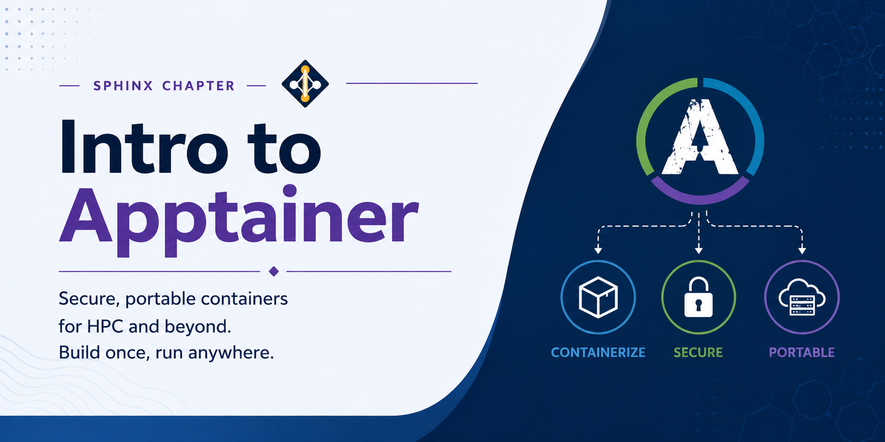

# Intro to Apptainer



Apptainer (formerly Singularity) is a container platform designed for HPC environments. Unlike Docker, Apptainer runs containers as the invoking user — no daemon, no root privilege escalation — making it safe and appropriate for shared cluster systems. Containers are single image files (`.sif`) that bundle an application and all its dependencies, ensuring reproducible execution across machines.

Containers solve the "it works on my machine" problem. By packaging your software, libraries, and configuration into a single portable image, you can run the exact same environment on your laptop, on lanec2, or on any other HPC system without reinstalling dependencies or worrying about conflicting system libraries.

---

## Apptainer vs Docker

Docker is the most widely used container platform for cloud and desktop environments, but it is not suitable for shared HPC systems. Docker requires a background daemon that runs with root privileges, which poses a security risk on multi-user clusters. Apptainer was designed from the ground up for HPC: it runs entirely as your own user, requires no daemon, and integrates naturally with SLURM and MPI workloads.

| Feature | Docker | Apptainer |
|---|---|---|
| Root required to run | Yes (daemon runs as root) | No (runs as the invoking user) |
| Suitable for HPC | No | Yes |
| Image format | Layered filesystem | Single `.sif` file |
| Networking | Full virtual network stack | Host network by default |
| Build from Docker images | — | Yes (`docker://` URI) |
| MPI support | Limited | Native |
| Home directory access | Manual volume mount | Automatic |

Despite these differences, Apptainer is fully compatible with the Docker ecosystem. You can pull any image from Docker Hub and convert it to a `.sif` file in a single command, so you do not need to rebuild or maintain separate images for the cluster.

> **Note:** Docker is not supported on lanec2 and there are no plans to support it in the future. The security model of Docker — which requires a privileged daemon — is fundamentally incompatible with a shared, multi-user HPC environment. Podman is a daemonless, rootless alternative to Docker that is architecturally closer to Apptainer, but it is also not available on lanec2. If you are looking for a container solution on the cluster, Apptainer is the only supported option.

---

## Apptainer on lanec2

Apptainer is installed system-wide on lanec2 and is available by default in every login and batch session — no `module load` command is required. This means you can use Apptainer immediately after logging in without any additional setup.

Confirm it is available and check the installed version:

```bash
apptainer --version
```

You should see output similar to `apptainer version 1.x.x`. If the command is not found, contact the cluster administrators.

---

## Building Containers

**You cannot build Apptainer containers on lanec2.** Building a container from a definition file requires either root access or unprivileged user namespace support, neither of which is available on the cluster for security reasons. Attempting to run `apptainer build` on lanec2 will result in a permission error.

The recommended workflow is to build your container on a local machine where you have the necessary privileges, and then transfer the resulting `.sif` file to your user space on lanec2. Building locally also lets you iterate quickly — install packages, test the container, and rebuild — before committing to a final image that you upload to the cluster.

Apptainer can be installed on:
- **Linux**: directly via your package manager or from the Apptainer GitHub releases
- **macOS**: via Lima (a Linux VM manager) or Rancher Desktop
- **Windows**: via WSL2 (Windows Subsystem for Linux)

### Build locally

A definition file (`.def`) describes how to build the container. It specifies a base image to start from and a set of instructions to run inside it during the build phase. The sections are:

- `Bootstrap` and `From`: define the starting image (here, Ubuntu 22.04 pulled from Docker Hub)
- `%post`: shell commands run as root during the build to install packages and configure the environment
- `%environment`: environment variables exported every time the container runs
- `%runscript`: the default command executed when the container is invoked with `apptainer run`

Create a definition file (`mycontainer.def`):

```
Bootstrap: docker
From: ubuntu:22.04

%post
    apt-get update && apt-get install -y nano

%environment
    export PATH=/usr/local/bin:$PATH

%runscript
    nano "$@"
```

This example builds a minimal Ubuntu container with `nano` installed. The `%runscript` section means that running the container with `apptainer run` will launch `nano`, passing any additional arguments directly to it.

Build the `.sif` image on your local machine:

```bash
apptainer build mycontainer.sif mycontainer.def
```

Apptainer will pull the base Ubuntu image, execute the `%post` commands, and produce a single `mycontainer.sif` file. The build may take a few minutes depending on the number of packages being installed.

### Upload to lanec2

Once the image is built, transfer it to your user space on the cluster using `scp`. It is good practice to keep all your container images in a dedicated directory such as `~/containers/` so they are easy to find and manage.

Create the directory on lanec2 first if it does not already exist:

```bash
ssh username@lanec2.compbio.cs.cmu.edu "mkdir -p ~/containers"
```

Then upload the image from your local machine:

```bash
scp mycontainer.sif username@lanec2.compbio.cs.cmu.edu:~/containers/
```

Large `.sif` files can take several minutes to transfer depending on your network connection. Once uploaded, the file is ready to use immediately in interactive sessions or SLURM batch jobs.

---

## Using Apptainer on lanec2

Apptainer provides several subcommands for interacting with container images. The most common are `exec`, `run`, `shell`, and `pull`.

### Run a command inside a container

`apptainer exec` runs a specific command inside the container and then exits. The container's filesystem and environment are used for the command, but your current working directory and home directory are automatically available inside the container.

```bash
apptainer exec mycontainer.sif python3 --version
```

This is the most commonly used subcommand in batch jobs, where you want to run a specific script or tool packaged inside the container.

### Run the container's default runscript

`apptainer run` executes the command defined in the `%runscript` section of the container's definition file. This is useful when the container is designed to behave like a self-contained application.

```bash
apptainer run mycontainer.sif script.py
```

If no `%runscript` was defined when the container was built, Apptainer will drop into a shell by default.

### Open an interactive shell inside a container

`apptainer shell` drops you into an interactive shell session inside the container. This is useful for exploring the container's environment, debugging, or running commands manually.

```bash
apptainer shell mycontainer.sif
```

Your prompt will change to indicate you are inside the container. Type `exit` to leave the container and return to the host shell.

### Pull a Docker image directly from Docker Hub

You can download and convert any public Docker image to a `.sif` file without needing to write a definition file. This is the fastest way to get a container image ready to use.

```bash
apptainer pull docker://python:3.11-slim
```

This produces `python_3.11-slim.sif` in the current directory. The image is pulled from Docker Hub, converted to the `.sif` format, and saved locally — ready to use with `exec`, `run`, or `shell`.

---

## Software available as containers in lanec2

| Category | Name | Latest | Last Commit |
| --- | --- | --- | --- |
| Scientific tool | [abyss](https://github.com/CBDatCMU/singularity-abyss) | — | — |
| Scientific tool | [anvio](https://github.com/CBDatCMU/singularity-anvio) | — | — |
| Scientific tool | [asciigenome](https://github.com/CBDatCMU/singularity-asciigenome) | — | — |
| Utility | [asciinema](https://github.com/CBDatCMU/singularity-asciinema) | — | — |
| Scientific tool | [aspera-connect](https://github.com/CBDatCMU/singularity-aspera-connect) | — | — |
| Scientific tool | [augustus](https://github.com/CBDatCMU/singularity-augustus) | — | — |
| Utility | [aws-cli](https://github.com/CBDatCMU/singularity-aws-cli) | — | — |
| Scientific tool | [bamtools](https://github.com/CBDatCMU/singularity-bamtools) | v2.5.2 | 2026-05-21 |
| Utility | [bat](https://github.com/CBDatCMU/singularity-bat) | v0.26.1 | 2026-05-12 |
| Scientific tool | [bcftools](https://github.com/CBDatCMU/singularity-bcftools) | — | — |
| Scientific tool | [bedops](https://github.com/CBDatCMU/singularity-bedops) | — | — |
| Scientific tool | [bedtools](https://github.com/CBDatCMU/singularity-bedtools) | — | — |
| Scientific tool | [bioformats2raw](https://github.com/CBDatCMU/singularity-bioformats2raw) | — | — |
| Scientific tool | [bismark](https://github.com/CBDatCMU/singularity-bismark) | — | — |
| Scientific tool | [blast](https://github.com/CBDatCMU/singularity-blast) | — | — |
| Scientific tool | [blat](https://github.com/CBDatCMU/singularity-blat) | — | — |
| Scientific tool | [bowtie2](https://github.com/CBDatCMU/singularity-bowtie2) | — | — |
| Scientific tool | [braker2](https://github.com/CBDatCMU/singularity-braker2) | — | — |
| Utility | [browsh](https://github.com/CBDatCMU/singularity-browsh) | — | — |
| Scientific tool | [bsmap](https://github.com/CBDatCMU/singularity-bsmap) | — | — |
| Utility | [btop](https://github.com/CBDatCMU/singularity-btop) | — | — |
| Scientific tool | [busco](https://github.com/CBDatCMU/singularity-busco) | — | — |
| Scientific tool | [bwa](https://github.com/CBDatCMU/singularity-bwa) | — | — |
| Scientific tool | [checkm](https://github.com/CBDatCMU/singularity-checkm) | — | — |
| Utility | [circos](https://github.com/CBDatCMU/singularity-circos) | — | — |
| Scientific tool | [cutadapt](https://github.com/CBDatCMU/singularity-cutadapt) | — | — |
| Utility | [cwltool](https://github.com/CBDatCMU/singularity-cwltool) | — | — |
| Utility | [dua](https://github.com/CBDatCMU/singularity-dua) | — | — |
| Utility | [dust](https://github.com/CBDatCMU/singularity-dust) | v1.2.4 | — |
| Scientific tool | [fastani](https://github.com/CBDatCMU/singularity-fastani) | — | — |
| Scientific tool | [fastq-tools](https://github.com/CBDatCMU/singularity-fastq-tools) | — | — |
| Scientific tool | [fastqc](https://github.com/CBDatCMU/singularity-fastqc) | — | — |
| Scientific tool | [fasttree](https://github.com/CBDatCMU/singularity-fasttree) | — | — |
| Utility | [fdupes](https://github.com/CBDatCMU/singularity-fdupes) | — | — |
| Utility | [ffmpeg](https://github.com/CBDatCMU/singularity-ffmpeg) | — | — |
| Scientific tool | [filtlong](https://github.com/CBDatCMU/singularity-filtlong) | — | — |
| Utility | [flac](https://github.com/CBDatCMU/singularity-flac) | — | — |
| Scientific tool | [flash](https://github.com/CBDatCMU/singularity-flash) | — | — |
| Scientific tool | [funannotate](https://github.com/CBDatCMU/singularity-funannotate) | — | — |
| Scientific tool | [gatk](https://github.com/CBDatCMU/singularity-gatk) | — | — |
| Utility | [gcalcli](https://github.com/CBDatCMU/singularity-gcalcli) | — | — |
| Scientific tool | [genemark-es](https://github.com/CBDatCMU/singularity-genemark-es) | — | — |
| Scientific tool | [gent](https://github.com/CBDatCMU/singularity-gent) | — | — |
| Remote Desktop Application | [gimp](https://github.com/CBDatCMU/singularity-gimp) | — | — |
| Utility | [glances](https://github.com/CBDatCMU/singularity-glances) | — | — |
| Utility | [gnuplot](https://github.com/CBDatCMU/singularity-gnuplot) | — | — |
| Utility | [graphviz](https://github.com/CBDatCMU/singularity-graphviz) | — | — |
| Scientific tool | [guppy](https://github.com/CBDatCMU/singularity-guppy) | — | — |
| Scientific tool | [guppy-gpu](https://github.com/CBDatCMU/singularity-guppy-gpu) | — | — |
| Utility | [hashdeep](https://github.com/CBDatCMU/singularity-hashdeep) | — | — |
| Scientific tool | [hisat2](https://github.com/CBDatCMU/singularity-hisat2) | — | — |
| Scientific tool | [hmmer](https://github.com/CBDatCMU/singularity-hmmer) | — | — |
| Scientific tool | [htslib](https://github.com/CBDatCMU/singularity-htslib) | — | — |
| Utility | [hyperfine](https://github.com/CBDatCMU/singularity-hyperfine) | — | — |
| Utility | [imagemagick](https://github.com/CBDatCMU/singularity-imagemagick) | — | — |
| Remote Desktop Application | [inkscape](https://github.com/CBDatCMU/singularity-inkscape) | — | — |
| Utility | [jp](https://github.com/CBDatCMU/singularity-jp) | — | — |
| Utility | [jq](https://github.com/CBDatCMU/singularity-jq) | — | — |
| Scientific tool | [kraken2](https://github.com/CBDatCMU/singularity-kraken2) | — | — |
| Utility | [lazygit](https://github.com/CBDatCMU/singularity-lazygit) | — | — |
| Utility | [libtiff-tools](https://github.com/CBDatCMU/singularity-libtiff-tools) | — | — |
| Utility | [lowcharts](https://github.com/CBDatCMU/singularity-lowcharts) | — | — |
| Utility | [mc](https://github.com/CBDatCMU/singularity-mc) | — | — |
| Scientific tool | [meme-suite](https://github.com/CBDatCMU/singularity-meme-suite) | — | — |
| Scientific tool | [methylpy](https://github.com/CBDatCMU/singularity-methylpy) | — | — |
| Scientific tool | [nanoplot](https://github.com/CBDatCMU/singularity-nanoplot) | — | — |
| Utility | [ncdu](https://github.com/CBDatCMU/singularity-ncdu) | — | — |
| Scientific tool | [ncview](https://github.com/CBDatCMU/singularity-ncview) | — | — |
| Scientific tool | [octave](https://github.com/CBDatCMU/singularity-octave) | — | — |
| Utility | [pandiff](https://github.com/CBDatCMU/singularity-pandiff) | — | — |
| Utility | [pandoc](https://github.com/CBDatCMU/singularity-pandoc) | — | — |
| Utility | [papis](https://github.com/CBDatCMU/singularity-papis) | — | — |
| Scientific tool | [phylip-suite](https://github.com/CBDatCMU/singularity-phylip-suite) | — | — |
| Scientific tool | [picard](https://github.com/CBDatCMU/singularity-picard) | — | — |
| Scientific tool | [porechop](https://github.com/CBDatCMU/singularity-porechop) | — | — |
| Scientific tool | [prodigal](https://github.com/CBDatCMU/singularity-prodigal) | — | — |
| Scientific tool | [raw2ometiff](https://github.com/CBDatCMU/singularity-raw2ometiff) | — | — |
| Scientific tool | [raxml](https://github.com/CBDatCMU/singularity-raxml) | — | — |
| Utility | [rclone](https://github.com/CBDatCMU/singularity-rclone) | — | — |
| Utility | [rich-cli](https://github.com/CBDatCMU/singularity-rich-cli) | — | — |
| Scientific tool | [rnaview](https://github.com/CBDatCMU/singularity-rnaview) | — | — |
| Scientific tool | [rust](https://github.com/CBDatCMU/singularity-rust) | — | — |
| Scientific tool | [salmon](https://github.com/CBDatCMU/singularity-salmon) | — | — |
| Scientific tool | [samtools](https://github.com/CBDatCMU/singularity-samtools) | — | — |
| Utility | [shellcheck](https://github.com/CBDatCMU/singularity-shellcheck) | — | — |
| Scientific tool | [spades](https://github.com/CBDatCMU/singularity-spades) | — | — |
| Scientific tool | [sra-toolkit](https://github.com/CBDatCMU/singularity-sra-toolkit) | — | — |
| Scientific tool | [star](https://github.com/CBDatCMU/singularity-star) | — | — |
| Scientific tool | [star-fusion](https://github.com/CBDatCMU/singularity-star-fusion) | — | — |
| Scientific tool | [stride](https://github.com/CBDatCMU/singularity-stride) | — | — |
| Scientific tool | [tiger](https://github.com/CBDatCMU/singularity-tiger) | — | — |
| Scientific tool | [trimmomatic](https://github.com/CBDatCMU/singularity-trimmomatic) | — | — |
| Scientific tool | [vcf2maf](https://github.com/CBDatCMU/singularity-vcf2maf) | — | — |
| Scientific tool | [viennarna](https://github.com/CBDatCMU/singularity-viennarna) | — | — |
| Utility | [vim](https://github.com/CBDatCMU/singularity-vim) | — | — |
| Utility | [visidata](https://github.com/CBDatCMU/singularity-visidata) | — | — |

---

## Example 1: Running a Python Script

This example shows how to pull a Python container from Docker Hub and use it to run an analysis script. This is useful when your script requires a specific Python version or set of packages that are not available in the system environment.

Pull the image (run this once, then reuse the `.sif` file):

```bash
apptainer pull docker://python:3.11-slim
```

Run your script inside the container:

```bash
apptainer exec python_3.11-slim.sif python3 my_analysis.py
```

**SLURM batch script (`run_python.sh`):**

```bash
#!/bin/bash
#SBATCH -p pool1
#SBATCH --time=04:00:00
#SBATCH --mem=8G
#SBATCH --ntasks=1
#SBATCH --cpus-per-task=4

apptainer exec ~/containers/mycontainer.sif python3 my_analysis.py
```

Submit the job to the queue:

```bash
sbatch run_python.sh
```

SLURM will allocate the requested resources and run the script inside the container. The output will appear in the default `slurm-<jobid>.out` file in your working directory.

---

## Example 2: Binding Host Directories

By default, Apptainer automatically mounts your home directory inside the container, so files in `~` are accessible without any extra flags. However, data stored in other locations — such as shared project directories or scratch storage — must be explicitly bound into the container using `--bind`.

The `--bind` flag takes the format `host_path:container_path`. The host path is the directory on lanec2 you want to access, and the container path is where it will appear inside the container.

```bash
apptainer exec --bind /data/project:/mnt/data mycontainer.sif python3 process.py
```

After this command, your script running inside the container can read and write files under `/mnt/data`, which maps directly to `/data/project` on the host. Changes are reflected immediately on the host filesystem — there is no copy step.

You can bind multiple directories in a single command by repeating the flag:

```bash
apptainer exec --bind /data/project:/mnt/data --bind /scratch/results:/mnt/results mycontainer.sif python3 process.py
```

**SLURM batch script (`run_bind.sh`):**

```bash
#!/bin/bash
#SBATCH -p pool1
#SBATCH --time=04:00:00
#SBATCH --mem=16G
#SBATCH --ntasks=1
#SBATCH --cpus-per-task=8

apptainer exec \
    --bind /data/project:/mnt/data \
    ~/containers/mycontainer.sif \
    python3 process.py
```

```bash
sbatch run_bind.sh
```

---

## Example 3: GPU Workloads

Apptainer can pass through host GPU devices to the container so that GPU-accelerated software such as PyTorch or TensorFlow runs against the physical hardware. The `--nv` flag enables NVIDIA GPU support by injecting the host CUDA drivers into the container at runtime. This means the container image itself does not need to include CUDA drivers — only the CUDA runtime libraries (such as `libcudart`) need to be present in the image.

For NVIDIA GPUs, use the `--nv` flag:

```bash
apptainer exec --nv ~/containers/pytorch.sif python3 train.py
```

For AMD GPUs, use `--rocm` instead of `--nv`.

Pull a CUDA-enabled PyTorch image from Docker Hub. Choose a tag that matches the CUDA version available on the cluster:

```bash
apptainer pull docker://pytorch/pytorch:2.2.0-cuda12.1-cudnn8-runtime
```

This produces a large `.sif` file (several gigabytes). Pull it once and reuse it across multiple jobs.

**SLURM batch script (`run_gpu.sh`):**

```bash
#!/bin/bash
#SBATCH -p gpu
#SBATCH --time=08:00:00
#SBATCH --mem=32G
#SBATCH --ntasks=1
#SBATCH --cpus-per-task=8
#SBATCH --gres=gpu:1

apptainer exec --nv \
    ~/containers/pytorch_2.2.0-cuda12.1-cudnn8-runtime.sif \
    python3 train.py
```

The `--gres=gpu:1` directive tells SLURM to allocate one GPU for the job. Apptainer will automatically bind the allocated GPU device into the container when `--nv` is specified.

```bash
sbatch run_gpu.sh
```

---

## Best Practices

- Store `.sif` files in a dedicated directory such as `~/containers/` to keep your home directory organized. `.sif` files can be large and are easy to lose track of if scattered across project directories.
- Use `apptainer pull docker://` to convert Docker Hub images rather than rebuilding from scratch. Most commonly used scientific software already has an official or community Docker image available.
- Use `--bind` explicitly for data directories outside your home to avoid relying on implicit mounts. Being explicit makes your batch scripts easier to understand and reproduce.
- Build and test your container locally before uploading to the cluster to avoid repeated large file transfers. A container that works on your laptop will work identically on lanec2.
- Use `apptainer inspect mycontainer.sif` to view the definition file and labels embedded in an image. This is useful for understanding what software is installed in a container you did not build yourself.
- Avoid building containers directly in your home directory on lanec2 — even though building is not supported, partially downloaded cache files from `apptainer pull` can consume significant disk space. Use `APPTAINER_CACHEDIR` to redirect the cache to scratch storage if needed.

---

## References

- Apptainer documentation: [https://apptainer.org/docs/user/latest/]
- Apptainer GitHub: [https://github.com/apptainer/apptainer]
