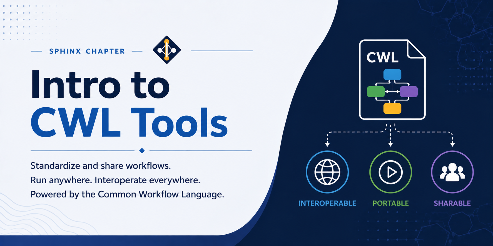

# Intro to Common Workflow Language (CWL)



The Common Workflow Language (CWL) is an open standard for describing command-line tools and workflows. Rather than being a tool itself, CWL is a specification — a common language that different workflow engines can understand and execute. This makes CWL workflows inherently portable: a workflow written in CWL can run on any CWL-compatible engine without modification, whether that is on a laptop, an HPC cluster, or a cloud platform.

CWL is particularly popular in bioinformatics and data-intensive research because it separates the description of a tool (what inputs it takes, what command it runs, what outputs it produces) from the values used in a specific run (the actual file paths and parameter values). This separation makes tools reusable and workflows easy to share and reproduce. `cwltool` is the reference implementation and is the recommended engine for running CWL workflows on the Lane Cluster.

---

## CWL vs Nextflow

CWL and Nextflow are both widely used workflow systems in scientific computing, but they take fundamentally different approaches to defining and running pipelines. Choosing between them depends on your priorities around portability, expressiveness, and ecosystem fit.

| Feature | CWL | Nextflow |
|---|---|---|
| Type | Open standard (multi-engine) | Framework with its own engine |
| Workflow language | Declarative YAML/JSON | Groovy-based DSL |
| Portability | Any CWL-compatible engine | Nextflow engine required |
| Learning curve | Steeper (verbose, strict schema) | Gentler (concise DSL) |
| Tool reuse | Strong (community tool registries) | Strong (nf-core module ecosystem) |
| Docker/Apptainer support | Yes (via hints/requirements) | Yes (via `container` directive) |
| SLURM integration | Via engine configuration | Native executor |
| Scatter/parallelism | Built-in (`scatter` field) | Built-in (channels and `each`) |
| Debugging | `cwltool --debug` | `.nextflow.log`, `work/` directory |
| Community tool libraries | BioContainers, Dockstore | nf-core |

**When to use CWL:**
- Your pipeline needs to run on multiple different platforms or be submitted to a public workflow repository such as Dockstore or WorkflowHub.
- Your institution or collaboration requires a platform-neutral standard that is not tied to any single vendor or tool.
- You are building tools that others will integrate into larger workflows and need a strict, machine-readable contract for inputs and outputs.

**When to use Nextflow:**
- You want a concise, expressive language and fast iteration during development.
- You are working in bioinformatics and want to leverage the nf-core ecosystem of pre-built, peer-reviewed pipelines.
- You need native, first-class SLURM integration with minimal configuration.

Both systems support containers (Docker, Apptainer/Singularity) and can run on the Lane Cluster. For new projects where portability across institutions is a priority, CWL is a strong choice. For projects where development speed and SLURM integration matter most, Nextflow is often more practical.

---

## Loading Miniconda3

Miniconda3 is the recommended way to manage Python environments on the Lane Cluster. It allows you to create isolated environments with specific package versions, which is important for reproducibility. Load the Miniconda3 module before creating or activating any conda environment:

```bash
module load miniconda3
```

This makes the `conda` command available in your current session. You need to run this command each time you start a new session or submit a batch job, unless it is added to your `.bashrc`.

## Creating a CWL Environment

It is good practice to create a dedicated conda environment for CWL rather than installing packages into the base environment. This keeps dependencies isolated and makes it easy to reproduce or share your setup.

Create a new environment named `cwl` with Python 3.11:

```bash
conda create -n cwl python=3.11
```

Conda will resolve and install the base Python packages. Once the environment is created, activate it:

```bash
conda activate cwl
```

Your shell prompt will change to show `(cwl)`, indicating the environment is active. All subsequent `pip` and `conda install` commands will install into this environment.

## Installing cwltool

With the `cwl` environment active, install `cwltool` from the conda-forge channel. conda-forge provides up-to-date builds of scientific Python packages and their dependencies:

```bash
conda install -c conda-forge cwltool
```

This installs `cwltool` along with all required dependencies, including the schema-salad validation library and supporting Python packages. Confirm the installation was successful:

```bash
cwltool --version
```

You should see output similar to `cwltool 3.x.yyyymmdd`. If the command is not found, make sure the `cwl` environment is active.

---

## Basic Concepts

A CWL workflow consists of two types of files:

- **Tool descriptions** (`.cwl`): YAML files that describe individual command-line tools — their inputs, outputs, base command, and any requirements such as Docker containers or shell features. Tool descriptions are reusable: the same `.cwl` file can be used in multiple workflows with different inputs.
- **Job input files** (`.yml` or `.json`): provide the concrete input values for a specific run — file paths, parameter values, and settings. Separating inputs from tool descriptions means you can re-run the same tool on different datasets by swapping the job file, without touching the tool description.

Workflows chain multiple tools together by declaring steps, where the output of one step feeds into the input of the next. CWL handles the data flow between steps automatically based on the connections you declare.

The key CWL classes are:
- `CommandLineTool`: wraps a single command-line tool
- `Workflow`: chains multiple tools or sub-workflows together
- `ExpressionTool`: performs lightweight in-memory data transformations using JavaScript expressions

---

## Example 1: Hello World

A minimal CWL tool that passes a message to the `echo` command. This example demonstrates the basic structure of a `CommandLineTool` document: a base command, an input with a binding that places the value on the command line, and an output that captures stdout.

**hello.cwl:**

```yaml
cwlVersion: v1.2
class: CommandLineTool
baseCommand: echo

inputs:
  message:
    type: string
    inputBinding:
      position: 1

outputs:
  stdout:
    type: stdout
```

The `inputBinding` field controls how the input value appears on the command line. `position: 1` means the value is placed as the first positional argument after the base command, producing the equivalent of `echo "Hello, Lane Cluster!"`.

**hello-job.yml:**

```yaml
message: "Hello, Lane Cluster!"
```

The job file supplies the concrete value for the `message` input declared in the tool description.

Run the tool:

```bash
cwltool hello.cwl hello-job.yml
```

`cwltool` reads the tool description, validates the inputs against the job file, executes the command in a temporary working directory, and captures the output.

**SLURM batch script (`run_hello.sh`):**

```bash
#!/bin/bash
#SBATCH -p pool1
#SBATCH --time=08:00:00
#SBATCH --mem=8G
#SBATCH --ntasks=16
#SBATCH --cpus-per-task=1

module load miniconda3
conda activate cwl

cwltool hello.cwl hello-job.yml
```

Submit the job:

```bash
sbatch run_hello.sh
```

---

## Example 2: File Processing

A tool that counts the number of lines in an input file using `wc -l`. This example shows how CWL handles file inputs: the job file references a file by path, and CWL stages the file into the working directory before the tool runs.

**count-lines.cwl:**

```yaml
cwlVersion: v1.2
class: CommandLineTool
baseCommand: [wc, -l]

inputs:
  input_file:
    type: File
    inputBinding:
      position: 1

outputs:
  line_count:
    type: stdout
```

The `baseCommand` here is a list, which is equivalent to running `wc -l`. The `File` input type tells CWL to treat the value as a file reference rather than a plain string — CWL will verify the file exists and make it available in the execution environment before the tool runs.

**count-lines-job.yml:**

```yaml
input_file:
  class: File
  path: data/input.txt
```

File inputs in job files use the `class: File` notation to distinguish them from plain string values. The `path` field is the location of the file on your filesystem.

Run the tool:

```bash
cwltool count-lines.cwl count-lines-job.yml
```

The output (the line count) is printed to stdout and also captured in a file in the output directory that `cwltool` creates.

**SLURM batch script (`run_count.sh`):**

```bash
#!/bin/bash
#SBATCH -p pool1
#SBATCH --time=08:00:00
#SBATCH --mem=8G
#SBATCH --ntasks=16
#SBATCH --cpus-per-task=1

module load miniconda3
conda activate cwl

cwltool count-lines.cwl count-lines-job.yml
```

```bash
sbatch run_count.sh
```

---

## Example 3: RNA-seq Alignment Pipeline

A multi-step workflow that aligns paired-end reads with HISAT2 and sorts the output with Samtools. This example demonstrates the `Workflow` class, which chains two `CommandLineTool` steps together. The output of the alignment step (a BAM file) is automatically passed as input to the sort step.

**align.cwl:**

```yaml
cwlVersion: v1.2
class: CommandLineTool
baseCommand: hisat2

arguments:
  - valueFrom: "$(inputs.index)"
    prefix: -x
  - valueFrom: "$(inputs.reads_r1.path)"
    prefix: "-1"
  - valueFrom: "$(inputs.reads_r2.path)"
    prefix: "-2"
  - valueFrom: "$(inputs.threads)"
    prefix: --threads
  - valueFrom: "| samtools view -bS - > aligned.bam"
    shellQuote: false

inputs:
  index:    { type: string }
  reads_r1: { type: File }
  reads_r2: { type: File }
  threads:  { type: int, default: 16 }

outputs:
  bam:
    type: File
    outputBinding:
      glob: aligned.bam

requirements:
  ShellCommandRequirement: {}
```

The `ShellCommandRequirement` is needed here because the command uses a shell pipe (`|`) to pass the HISAT2 output directly to `samtools view`. Without this requirement, CWL would not interpret shell metacharacters. The `arguments` section uses CWL parameter references (`$(inputs.x)`) to insert input values into the command line.

**sort.cwl:**

```yaml
cwlVersion: v1.2
class: CommandLineTool
baseCommand: [samtools, sort]

inputs:
  bam:
    type: File
    inputBinding:
      position: 1
  threads:
    type: int
    default: 16
    inputBinding:
      prefix: -@
  output_name:
    type: string
    default: sorted.bam
    inputBinding:
      prefix: -o

outputs:
  sorted_bam:
    type: File
    outputBinding:
      glob: "$(inputs.output_name)"
```

The `outputBinding.glob` field tells CWL where to find the output file after the command finishes. The expression `$(inputs.output_name)` evaluates to the value of the `output_name` input, making the output filename configurable.

**rnaseq-workflow.cwl:**

```yaml
cwlVersion: v1.2
class: Workflow

inputs:
  index:    string
  reads_r1: File
  reads_r2: File
  threads:  int

outputs:
  sorted_bam:
    type: File
    outputSource: sort/sorted_bam

steps:
  align:
    run: align.cwl
    in:
      index:    index
      reads_r1: reads_r1
      reads_r2: reads_r2
      threads:  threads
    out: [bam]

  sort:
    run: sort.cwl
    in:
      bam:     align/bam
      threads: threads
    out: [sorted_bam]
```

The `Workflow` class declares the overall inputs and outputs and lists the steps in order. Each step references a tool file via `run`, maps workflow inputs to tool inputs via `in`, and declares its outputs via `out`. The connection `bam: align/bam` means the `bam` output from the `align` step is wired into the `bam` input of the `sort` step.

**rnaseq-job.yml:**

```yaml
index: /path/to/genome_index
reads_r1:
  class: File
  path: reads/sample1_R1.fastq.gz
reads_r2:
  class: File
  path: reads/sample1_R2.fastq.gz
threads: 16
```

Validate the workflow before running to catch any schema or connectivity errors:

```bash
cwltool --validate rnaseq-workflow.cwl
```

Run the workflow:

```bash
cwltool rnaseq-workflow.cwl rnaseq-job.yml
```

**SLURM batch script (`run_rnaseq.sh`):**

```bash
#!/bin/bash
#SBATCH -p pool1
#SBATCH --time=08:00:00
#SBATCH --mem=8G
#SBATCH --ntasks=16
#SBATCH --cpus-per-task=1

module load miniconda3
conda activate cwl

cwltool rnaseq-workflow.cwl rnaseq-job.yml
```

```bash
sbatch run_rnaseq.sh
```

---

## Best Practices

- Keep tool descriptions (`.cwl`) and job input files (`.yml`) in separate directories. Tool descriptions should be version-controlled and reusable; job files are run-specific and may contain local paths.
- Always validate a workflow before submitting it to the cluster. Validation catches schema errors, missing required inputs, and broken step connections without executing any commands:

```bash
cwltool --validate rnaseq-workflow.cwl
```

- Use `cwltool --debug` for verbose output when troubleshooting a failing step. The debug log shows the exact command line constructed for each tool, the working directory, and any captured stderr.
- Store all input file paths as absolute paths in job files when running on the cluster. Relative paths are resolved from the working directory where `cwltool` is invoked, which can differ between interactive sessions and batch jobs.
- Use the `DockerRequirement` or `SoftwareRequirement` hints in tool descriptions to declare software dependencies. This improves portability and allows other users to reproduce your results without manually installing dependencies.
- Use `scatter` to parallelize a tool over a list of inputs without writing a loop. CWL handles the fan-out and fan-in automatically.

---

## References

- CWL specification: [https://www.commonwl.org/]
- cwltool documentation: [https://github.com/common-workflow-language/cwltool]
- CWL user guide: [https://www.commonwl.org/user_guide/]
- Dockstore (CWL workflow registry): [https://dockstore.org/]
