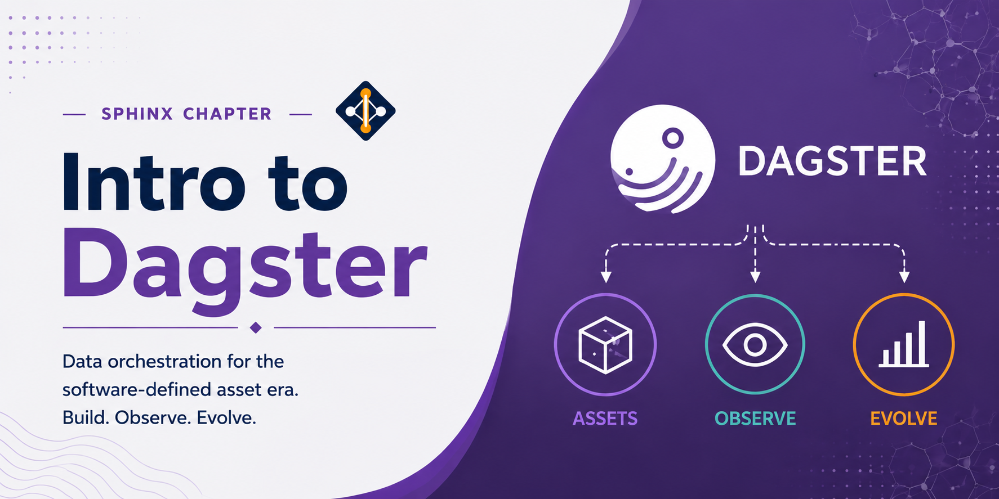

# Intro to Dagster



Dagster is an open-source data orchestration platform designed for building, testing, and monitoring data pipelines. It introduces the concept of software-defined assets — data objects that your pipeline produces — making it easy to reason about data dependencies, track lineage, and observe pipeline health across runs.

## What Is Dagster Useful For?

- **Data engineering pipelines**: define ETL workflows as code with explicit asset dependencies and automatic lineage tracking
- **ML workflows**: orchestrate feature engineering, model training, and evaluation steps with full observability
- **Reproducibility**: every run is logged with inputs, outputs, and metadata for auditing and debugging
- **Testing**: pipelines are plain Python and can be unit-tested without running the full orchestration layer
- **Observability**: built-in UI (Dagit) shows asset graphs, run history, logs, and alerts

---

## Loading Miniconda3

Miniconda3 is available as a module on the Lane Cluster. Load it using:

```bash
module load miniconda3
```

## Creating a Dagster Environment

Create a dedicated conda environment for Dagster:

```bash
conda create -n dagster python=3.11
```

Activate the environment:

```bash
conda activate dagster
```

## Installing Dagster

With the environment active, install Dagster and its web UI via pip:

```bash
pip install dagster dagster-webserver
```

Confirm the installation:

```bash
dagster --version
```

---

## Basic Concepts

- **Assets**: data objects (files, tables, models) produced by your pipeline; defined with `@asset`
- **Ops**: individual units of computation; defined with `@op`
- **Jobs**: a graph of ops wired together and configured for execution; defined with `@job`
- **Resources**: shared connections or clients (databases, APIs) injected into ops and assets
- **Schedules and sensors**: trigger jobs on a time interval or in response to external events

---

## Example 1: Hello World Job

A minimal job that prints a greeting.

**hello_dagster.py:**

```python
from dagster import job, op

@op
def say_hello():
    print("Hello, Lane Cluster!")

@job
def hello_job():
    say_hello()

if __name__ == "__main__":
    hello_job.execute_in_process()
```

Run the job directly:

```bash
python hello_dagster.py
```

**SLURM batch script (`run_hello.sh`):**

```bash
#!/bin/bash
#SBATCH -p pool1
#SBATCH --time=01:00:00
#SBATCH --mem=4G
#SBATCH --ntasks=1
#SBATCH --cpus-per-task=1

module load miniconda3
conda activate dagster

python hello_dagster.py
```

```bash
sbatch run_hello.sh
```

---

## Example 2: Multi-Step Pipeline

A job with multiple ops passing data between steps.

**pipeline.py:**

```python
from dagster import job, op

@op
def load_data():
    return [1, 2, 3, 4, 5]

@op
def process_data(data):
    return [x * 2 for x in data]

@op
def save_results(results):
    for r in results:
        print(f"Result: {r}")

@job
def data_pipeline():
    save_results(process_data(load_data()))

if __name__ == "__main__":
    data_pipeline.execute_in_process()
```

Run the pipeline:

```bash
python pipeline.py
```

**SLURM batch script (`run_pipeline.sh`):**

```bash
#!/bin/bash
#SBATCH -p pool1
#SBATCH --time=02:00:00
#SBATCH --mem=8G
#SBATCH --ntasks=1
#SBATCH --cpus-per-task=4

module load miniconda3
conda activate dagster

python pipeline.py
```

```bash
sbatch run_pipeline.sh
```

---

## Example 3: Software-Defined Assets

A workflow using assets to define data dependencies explicitly.

**assets_flow.py:**

```python
from dagster import asset, materialize
import pandas as pd

@asset
def raw_data():
    return pd.DataFrame({"value": range(100)})

@asset
def filtered_data(raw_data):
    return raw_data[raw_data["value"] > 50]

@asset
def summary(filtered_data):
    return filtered_data.describe()

if __name__ == "__main__":
    result = materialize([raw_data, filtered_data, summary])
    print(result.output_for_node("summary"))
```

Install pandas if needed:

```bash
pip install pandas
```

Run the asset pipeline:

```bash
python assets_flow.py
```

**SLURM batch script (`run_assets.sh`):**

```bash
#!/bin/bash
#SBATCH -p pool1
#SBATCH --time=04:00:00
#SBATCH --mem=16G
#SBATCH --ntasks=1
#SBATCH --cpus-per-task=4

module load miniconda3
conda activate dagster

python assets_flow.py
```

```bash
sbatch run_assets.sh
```

---

## Launching the Dagster UI

To inspect assets, run history, and logs interactively, launch the Dagit web server:

```bash
dagster dev -f assets_flow.py
```

Open `http://localhost:3000` in a browser to view the asset graph and trigger runs manually.

---

## Best Practices

- Prefer `@asset` over `@op`/`@job` for data engineering work — assets make lineage and dependencies explicit.
- Use resources to share database connections or API clients across ops rather than instantiating them inside each op.
- Write unit tests using `execute_in_process()` to validate op logic without the full orchestration layer.
- Use `config` schemas on ops and assets to make pipelines configurable without editing source code.
- Check run logs in Dagit or via `dagster job execute --log-level debug` for debugging failed runs.

---

## References

- Dagster documentation: [https://docs.dagster.io]
- Dagster GitHub: [https://github.com/dagster-io/dagster]
