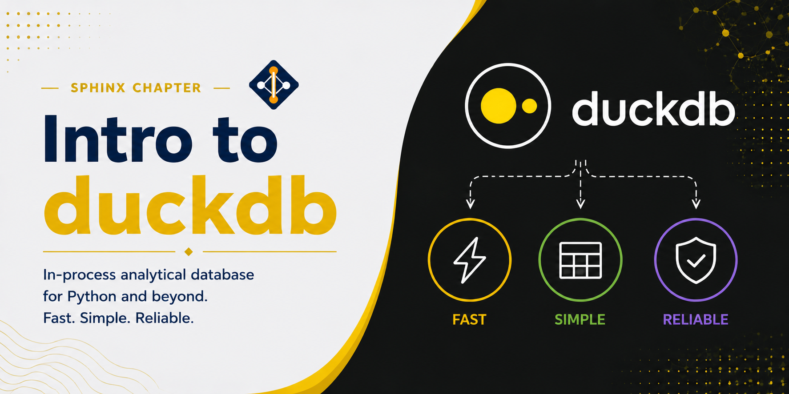

# Intro to DuckDB



DuckDB is an in-process analytical database designed for fast, interactive queries on tabular data. Unlike traditional database servers (PostgreSQL, MySQL), DuckDB runs entirely within your Python process — there is no server to start, no connection to manage, and no external service required. It reads and writes Parquet, CSV, and JSON files directly, and integrates natively with Pandas and Polars DataFrames.

DuckDB is built around a columnar-vectorized query engine optimized for analytical (OLAP) workloads: aggregations, joins, and scans over large tables. For these operations it is typically much faster than Pandas and competitive with distributed systems like Dask or Spark — on a single machine with no cluster overhead.

On the Lane Cluster, DuckDB is well suited for preprocessing large flat files, running complex SQL aggregations on data stored in Parquet or CSV format, and as a lightweight alternative to loading entire datasets into memory with Pandas.

## What Is DuckDB Useful For?

- **Fast analytical queries**: columnar execution and vectorized processing make GROUP BY, JOIN, and window functions orders of magnitude faster than row-oriented databases
- **Querying files directly**: run SQL on Parquet, CSV, and JSON files without loading them into memory first — DuckDB streams and filters at the storage layer
- **In-memory analytics**: import a Pandas or Polars DataFrame, query it with SQL, and get the result back as a DataFrame — no serialization overhead
- **Complex aggregations**: multi-column GROUP BY with window functions, percentiles, and statistical aggregates that are verbose in Pandas become concise SQL
- **ETL pipelines on a single node**: read from one format, transform with SQL, write to another format — all in a single script with no cluster required
- **Replacing heavyweight databases**: for read-heavy analytical work that does not require concurrent writes, DuckDB eliminates the need for a running database server

---

## Loading Miniconda3

Miniconda3 is available as a module on the Lane Cluster. Load it before creating or activating any conda environment:

```bash
module load miniconda3
```

## Creating a DuckDB Environment

Create a dedicated conda environment:

```bash
conda create -n duckdb python=3.11
```

Activate the environment:

```bash
conda activate duckdb
```

## Installing DuckDB

Install DuckDB and common companions via pip (DuckDB is not on conda-forge for all platforms):

```bash
pip install duckdb pandas pyarrow
```

Confirm the installation:

```{jupyter-execute}
import duckdb
print(duckdb.__version__)
```

---

## Basic Concepts

- **In-process engine**: DuckDB runs inside your Python interpreter. There is no server process, no TCP connection, and no configuration file. `import duckdb` is the entire setup.
- **Connection**: a `duckdb.connect()` call returns a connection object. Use `duckdb.connect()` for an in-memory database or `duckdb.connect("file.db")` to persist data to disk.
- **Relation**: DuckDB's lazy query object. Calling `con.sql("SELECT ...")` returns a `Relation` that is only executed when you call `.fetchdf()`, `.pl()`, or `.show()`.
- **Columnar storage**: data is stored column by column internally, which means analytical queries that touch only a few columns scan far less data than row-oriented formats.
- **Arrow-native**: DuckDB uses Apache Arrow as its internal memory format, enabling zero-copy data exchange with Pandas and Polars.

---

## Example 1: First Queries with DuckDB

This example introduces the basic DuckDB workflow: open an in-memory connection, run SQL directly on a Python list or generated data, and retrieve results as a Pandas DataFrame. DuckDB can generate synthetic data using its built-in `range()` and `random()` functions, which is useful for benchmarking and prototyping queries without any input files.

```{jupyter-execute}
import duckdb
import pandas as pd

# Open an in-memory DuckDB connection — no files, no server
con = duckdb.connect()

# DuckDB can run SQL directly against generated data using range() and random()
result = con.sql("""
    SELECT
        i                                        AS id,
        round(random() * 100, 2)                 AS score,
        CASE WHEN i % 3 = 0 THEN 'A'
             WHEN i % 3 = 1 THEN 'B'
             ELSE 'C' END                        AS group_label
    FROM range(1, 11) t(i)
""").df()

print(result)
```

```{jupyter-execute}
# Aggregate the result using a second SQL query on the DataFrame
summary = con.sql("""
    SELECT
        group_label,
        count(*)          AS n,
        round(avg(score), 2)  AS mean_score,
        round(min(score), 2)  AS min_score,
        round(max(score), 2)  AS max_score
    FROM result
    GROUP BY group_label
    ORDER BY group_label
""").df()

print(summary)
```

---

## Example 2: Querying a Pandas DataFrame with SQL

One of DuckDB's most useful features is the ability to query a Pandas DataFrame directly using SQL — without copying the data. DuckDB registers the DataFrame by name and treats it as a virtual table. This lets you use the full power of SQL (window functions, complex joins, CTEs) on data you already have in memory, without learning a new API.

```{jupyter-execute}
import duckdb
import pandas as pd
import numpy as np

np.random.seed(42)
n = 10_000

# Simulate a gene expression dataset: each row is one measurement
df = pd.DataFrame({
    "gene_id":   [f"GENE_{i % 500:04d}" for i in range(n)],
    "sample_id": [f"S{i % 20:02d}" for i in range(n)],
    "condition": np.random.choice(["control", "treated"], size=n),
    "expression": np.round(np.random.lognormal(mean=3.0, sigma=1.0, size=n), 4),
    "replicate":  np.random.randint(1, 4, size=n),
})

con = duckdb.connect()

# DuckDB reads the Pandas DataFrame directly — no copy, no serialization
top_genes = con.sql("""
    SELECT
        gene_id,
        condition,
        round(avg(expression), 4)   AS mean_expr,
        round(stddev(expression), 4) AS std_expr,
        count(*)                    AS n_obs
    FROM df
    GROUP BY gene_id, condition
    HAVING count(*) >= 5
    ORDER BY mean_expr DESC
    LIMIT 10
""").df()

print("Top 10 genes by mean expression:")
print(top_genes)
```

---

## Example 3: Window Functions and Rankings

SQL window functions let you compute running totals, rankings, and moving averages over partitions of a dataset without collapsing rows. In Pandas, these operations require chaining `.groupby()`, `.transform()`, `.rank()`, and `.rolling()` — which is verbose and easy to get wrong. In DuckDB, the same logic is expressed in a single SQL query using `OVER (PARTITION BY ... ORDER BY ...)`.

```{jupyter-execute}
import duckdb
import pandas as pd
import numpy as np

np.random.seed(7)
n = 500

# Simulate monthly sales data for multiple products across regions
sales = pd.DataFrame({
    "month":   pd.date_range("2023-01-01", periods=n, freq="D").strftime("%Y-%m").tolist(),
    "region":  np.random.choice(["North", "South", "East", "West"], size=n),
    "product": np.random.choice(["Alpha", "Beta", "Gamma"], size=n),
    "revenue": np.round(np.random.exponential(scale=5000, size=n), 2),
})

con = duckdb.connect()

ranked = con.sql("""
    WITH monthly AS (
        -- Aggregate to monthly revenue per region and product
        SELECT
            month,
            region,
            product,
            round(sum(revenue), 2) AS total_revenue
        FROM sales
        GROUP BY month, region, product
    )
    SELECT
        month,
        region,
        product,
        total_revenue,
        -- Rank products within each region-month by revenue (1 = highest)
        rank() OVER (
            PARTITION BY month, region
            ORDER BY total_revenue DESC
        ) AS rank_in_region,
        -- Running cumulative revenue per product over time
        round(sum(total_revenue) OVER (
            PARTITION BY product
            ORDER BY month
            ROWS BETWEEN UNBOUNDED PRECEDING AND CURRENT ROW
        ), 2) AS cumulative_revenue
    FROM monthly
    ORDER BY month, region, rank_in_region
    LIMIT 15
""").df()

print(ranked)
```

---

## Example 4: Reading and Writing Parquet Files

Parquet is the preferred file format for large analytical datasets — it is columnar, compressed, and preserves data types. DuckDB can read and write Parquet files directly without loading the full file into memory first. This makes it practical to query multi-gigabyte files on a single node without running out of RAM, because DuckDB streams only the columns and rows needed to satisfy the query.

```{jupyter-execute}
import duckdb
import pandas as pd
import numpy as np
import tempfile
import os

np.random.seed(0)
n = 100_000

# Build a synthetic clinical dataset and write it to Parquet
df = pd.DataFrame({
    "patient_id": [f"P{i:06d}" for i in range(n)],
    "age":        np.random.randint(18, 90, size=n),
    "sex":        np.random.choice(["M", "F"], size=n),
    "diagnosis":  np.random.choice(["healthy", "mild", "severe"], size=n, p=[0.5, 0.3, 0.2]),
    "biomarker":  np.round(np.random.lognormal(2.0, 0.8, size=n), 4),
    "visit":      np.random.randint(1, 6, size=n),
})

# Write to a temporary Parquet file to simulate a data file on disk
tmpfile = tempfile.mktemp(suffix=".parquet")
df.to_parquet(tmpfile, index=False)

con = duckdb.connect()

# Query the Parquet file directly — DuckDB reads only the required columns
summary = con.sql(f"""
    SELECT
        diagnosis,
        sex,
        count(*)                       AS n_patients,
        round(avg(age), 1)             AS mean_age,
        round(avg(biomarker), 4)       AS mean_biomarker,
        round(percentile_cont(0.5)
            WITHIN GROUP (ORDER BY biomarker), 4) AS median_biomarker
    FROM read_parquet('{tmpfile}')
    GROUP BY diagnosis, sex
    ORDER BY diagnosis, sex
""").df()

print("Summary from Parquet file (no full load into memory):")
print(summary)

os.remove(tmpfile)
```

---

## Example 5: Joining Multiple DataFrames

Joining multiple tables is one of the most common operations in data analysis. Pandas `.merge()` handles this well for two tables, but multi-way joins with filtering conditions become awkward quickly. DuckDB executes multi-table SQL JOINs with its optimized hash-join engine, which is typically faster than Pandas for large tables and easier to read when joining more than two sources.

```{jupyter-execute}
import duckdb
import pandas as pd
import numpy as np

np.random.seed(5)

# Patient demographics table
patients = pd.DataFrame({
    "patient_id": [f"P{i:04d}" for i in range(200)],
    "age":        np.random.randint(20, 80, size=200),
    "cohort":     np.random.choice(["A", "B", "C"], size=200),
})

# Lab measurements: multiple rows per patient across different visits
labs = pd.DataFrame({
    "patient_id": [f"P{i % 200:04d}" for i in range(1200)],
    "test":       np.random.choice(["CRP", "LDH", "ALT"], size=1200),
    "value":      np.round(np.random.exponential(scale=30, size=1200), 3),
    "visit":      np.random.randint(1, 5, size=1200),
})

# Treatment assignments: not every patient is in a trial
treatments = pd.DataFrame({
    "patient_id": [f"P{i:04d}" for i in np.random.choice(200, size=120, replace=False)],
    "drug":       np.random.choice(["DrugA", "DrugB", "Placebo"], size=120),
})

con = duckdb.connect()

# Three-way join: labs → patients → treatments (left join to keep unmatched patients)
result = con.sql("""
    SELECT
        p.cohort,
        t.drug,
        l.test,
        count(*)                    AS n_measurements,
        round(avg(l.value), 3)      AS mean_value,
        round(stddev(l.value), 3)   AS std_value
    FROM labs l
    JOIN patients p
        ON l.patient_id = p.patient_id
    LEFT JOIN treatments t
        ON l.patient_id = t.patient_id
    GROUP BY p.cohort, t.drug, l.test
    ORDER BY p.cohort, t.drug, l.test
    LIMIT 15
""").df()

print(result)
```

---

## Example 6: DuckDB vs Pandas Performance

For analytical queries over large tables, DuckDB's columnar engine typically outperforms Pandas. This example runs an identical multi-column GROUP BY aggregation on a 2-million-row DataFrame using both Pandas and DuckDB, and compares wall-clock time. The advantage grows with dataset size and query complexity.

```{jupyter-execute}
import duckdb
import pandas as pd
import numpy as np
import time

np.random.seed(1)
n = 2_000_000

df = pd.DataFrame({
    "group_a": np.random.choice(list("ABCDE"), size=n),
    "group_b": np.random.choice(["x", "y", "z"], size=n),
    "val1":    np.random.random(n),
    "val2":    np.random.random(n),
    "val3":    np.random.random(n),
})

# Pandas: multi-column groupby with multiple aggregations
t0 = time.perf_counter()
pandas_result = (
    df.groupby(["group_a", "group_b"])
    .agg(
        val1_mean=("val1", "mean"),
        val2_mean=("val2", "mean"),
        val3_sum=("val3", "sum"),
        n=("val1", "count"),
    )
    .reset_index()
)
pandas_time = time.perf_counter() - t0

# DuckDB: equivalent SQL query on the same DataFrame (zero-copy)
con = duckdb.connect()
t0 = time.perf_counter()
duckdb_result = con.sql("""
    SELECT
        group_a,
        group_b,
        avg(val1)   AS val1_mean,
        avg(val2)   AS val2_mean,
        sum(val3)   AS val3_sum,
        count(*)    AS n
    FROM df
    GROUP BY group_a, group_b
""").df()
duckdb_time = time.perf_counter() - t0

print(f"Pandas:  {pandas_time:.3f}s")
print(f"DuckDB:  {duckdb_time:.3f}s")
print(f"Speedup: {pandas_time / duckdb_time:.2f}x")
print(f"\nResult shape: {duckdb_result.shape}")
print(duckdb_result.sort_values(["group_a", "group_b"]).head(6))
```

---

## Best Practices

- Prefer Parquet over CSV for large files. DuckDB can read Parquet with predicate and projection pushdown — it skips irrelevant columns and row groups entirely, so queries on a 10 GB Parquet file may touch only a fraction of the data.
- Use `con.sql(...).df()` to get a Pandas DataFrame, `.pl()` for Polars, or `.arrow()` for PyArrow. Each is a zero-copy transfer from DuckDB's Arrow-native memory.
- For one-off queries, the module-level `duckdb.sql(...)` shorthand uses a shared in-memory connection. Use an explicit `duckdb.connect()` when running multiple related queries that need to share tables or settings.
- Register large DataFrames with `con.register("name", df)` when you will query the same DataFrame many times in a session. This avoids the overhead of re-scanning the DataFrame object on every query.
- DuckDB is single-node and single-process. For data that exceeds available RAM, use chunked Parquet reads (`read_parquet` with `hive_partitioning=True`) or switch to a distributed system such as Dask or Spark.
- Avoid loading entire files into Pandas just to filter them. Write `FROM read_parquet('file.parquet') WHERE condition` instead and let DuckDB push the filter down to storage.

---

## References

- DuckDB documentation: [https://duckdb.org/docs/]
- DuckDB Python API: [https://duckdb.org/docs/api/python/overview]
- DuckDB GitHub: [https://github.com/duckdb/duckdb]
- PyPI: [https://pypi.org/project/duckdb/]
