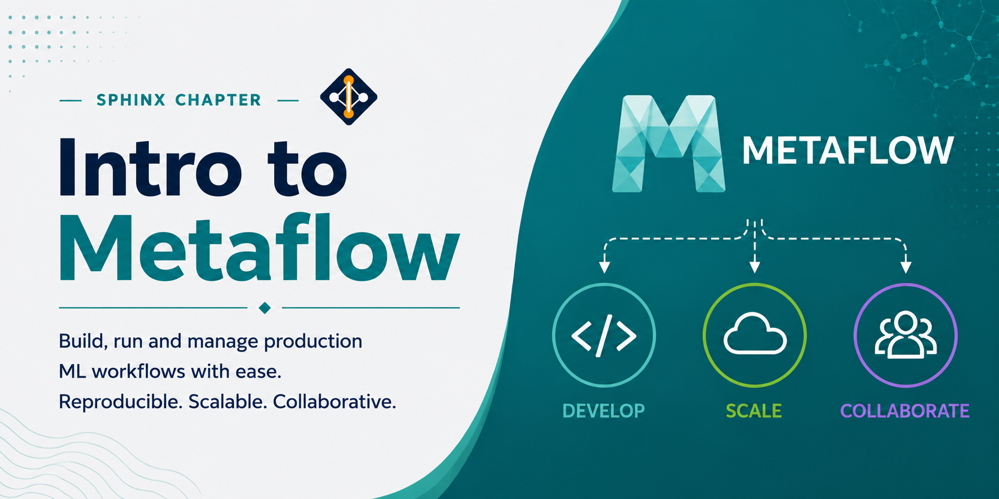

# Intro to Metaflow



Metaflow is an open-source Python framework originally developed at Netflix for building and managing real-life data science and machine learning workflows. It provides a simple decorator-based API for defining steps, and handles versioning, dependency management, and scalable execution on HPC clusters and cloud environments.

## What Is Metaflow Useful For?

- **Data science pipelines**: structure multi-step ML workflows as code with automatic versioning of results at each step
- **Reproducibility**: every run is tracked and results can be inspected or resumed at any step
- **Scalability**: run steps locally for development and switch to SLURM or cloud with minimal changes
- **Dependency management**: package Python environments per step using conda or pip decorators
- **Experiment tracking**: inspect past runs, compare parameters, and retrieve artifacts from any previous execution

---

## Loading Miniconda3

Miniconda3 is available as a module on the Lane Cluster. Load it using:

```bash
module load miniconda3
```

## Creating a Metaflow Environment

Create a dedicated conda environment for Metaflow:

```bash
conda create -n metaflow python=3.11
```

Activate the environment:

```bash
conda activate metaflow
```

## Installing Metaflow

With the environment active, install Metaflow via pip:

```bash
pip install metaflow
```

Confirm the installation:

```bash
python -c "import metaflow; print(metaflow.__version__)"
```

---

## Basic Concepts

A Metaflow workflow is a Python class that inherits from `FlowSpec`. The key building blocks are:

- **Steps**: methods decorated with `@step`; each step is a discrete unit of work
- **`self.next()`**: called at the end of every step to declare the next step(s) to run
- **Artifacts**: any attribute assigned to `self` inside a step is automatically persisted and accessible in later steps
- **Decorators**: `@conda`, `@resources`, `@retry`, `@timeout`, and others control the execution environment and behavior of individual steps

---

## Example 1: Hello World

A minimal flow that prints a greeting.

**hello.py:**

```python
from metaflow import FlowSpec, step

class HelloFlow(FlowSpec):

    @step
    def start(self):
        print("Hello, Lane Cluster!")
        self.next(self.end)

    @step
    def end(self):
        print("Flow complete.")

if __name__ == "__main__":
    HelloFlow()
```

Run the flow:

```bash
python hello.py run
```

**SLURM batch script (`run_hello.sh`):**

```bash
#!/bin/bash
#SBATCH -p pool1
#SBATCH --time=01:00:00
#SBATCH --mem=4G
#SBATCH --ntasks=1
#SBATCH --cpus-per-task=1

module load miniconda3
conda activate metaflow

python hello.py run
```

```bash
sbatch run_hello.sh
```

---

## Example 2: Parameter Flow

A flow that accepts a runtime parameter and fans out over multiple values.

**param_flow.py:**

```python
from metaflow import FlowSpec, Parameter, step

class ParamFlow(FlowSpec):

    samples = Parameter("samples", help="Number of samples", default=10)

    @step
    def start(self):
        print(f"Running with {self.samples} samples")
        self.next(self.process)

    @step
    def process(self):
        self.result = list(range(self.samples))
        print(f"Processed {len(self.result)} items")
        self.next(self.end)

    @step
    def end(self):
        print("Done.")

if __name__ == "__main__":
    ParamFlow()
```

Run with a custom parameter value:

```bash
python param_flow.py run --samples 50
```

**SLURM batch script (`run_param.sh`):**

```bash
#!/bin/bash
#SBATCH -p pool1
#SBATCH --time=02:00:00
#SBATCH --mem=8G
#SBATCH --ntasks=1
#SBATCH --cpus-per-task=4

module load miniconda3
conda activate metaflow

python param_flow.py run --samples 50
```

```bash
sbatch run_param.sh
```

---

## Example 3: Parallel Fan-Out

A flow that processes multiple items in parallel using a foreach branch.

**parallel_flow.py:**

```python
from metaflow import FlowSpec, step

class ParallelFlow(FlowSpec):

    @step
    def start(self):
        self.inputs = ["sample_A", "sample_B", "sample_C"]
        self.next(self.process, foreach="inputs")

    @step
    def process(self):
        self.output = f"Processed {self.input}"
        print(self.output)
        self.next(self.join)

    @step
    def join(self, inputs):
        self.results = [inp.output for inp in inputs]
        self.next(self.end)

    @step
    def end(self):
        for r in self.results:
            print(r)

if __name__ == "__main__":
    ParallelFlow()
```

Run the flow:

```bash
python parallel_flow.py run
```

**SLURM batch script (`run_parallel.sh`):**

```bash
#!/bin/bash
#SBATCH -p pool1
#SBATCH --time=04:00:00
#SBATCH --mem=16G
#SBATCH --ntasks=4
#SBATCH --cpus-per-task=4

module load miniconda3
conda activate metaflow

python parallel_flow.py run
```

```bash
sbatch run_parallel.sh
```

---

## Inspecting Past Runs

Metaflow tracks every run automatically. Use the client API to inspect results:

```python
from metaflow import Flow, Run

# List all runs for a flow
for run in Flow("ParallelFlow"):
    print(run.id, run.finished_at)

# Access artifacts from the latest successful run
run = Flow("ParallelFlow").latest_successful_run
print(run.data.results)
```

---

## Best Practices

- Use `Parameter` for all user-configurable values so flows can be reused without editing source code.
- Use `@retry` on steps that call external services or read from shared storage to handle transient failures.
- Use `foreach` to parallelize independent work items rather than writing manual parallelism.
- Keep each step focused on a single task so that failed runs can be resumed efficiently.
- Use `python flow.py show` to display the DAG of steps before running a flow.

---

## References

- Metaflow documentation: [https://docs.metaflow.org]
- Metaflow GitHub: [https://github.com/Netflix/metaflow]
