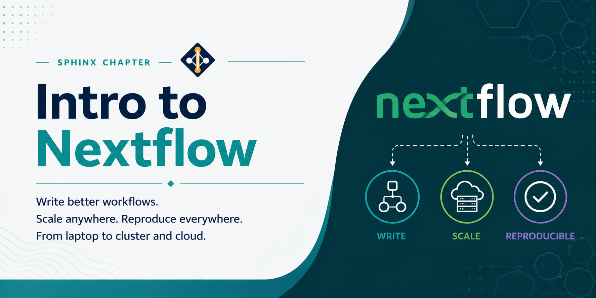

# Intro to Nextflow



Nextflow is a workflow management system that enables scalable and reproducible scientific workflows. It uses a dataflow programming model, where processes are connected through channels, making it well suited for parallel and distributed execution on HPC clusters.

## Loading Miniconda3

Miniconda3 is available as a module on the Lane Cluster. Load it using:

```bash
module load miniconda3
```

## Creating a Nextflow Environment

Create a dedicated conda environment for Nextflow:

```bash
conda create -n nextflow python=3.11
```

Activate the environment:

```bash
conda activate nextflow
```

## Installing Nextflow

With the environment active, install Nextflow via conda-forge and bioconda:

```bash
conda install -c conda-forge -c bioconda nextflow
```

Confirm the installation:

```bash
nextflow -version
```

---

## Basic Concepts

A Nextflow workflow is defined in a file called `main.nf`. The key building blocks are:

- **Processes**: individual computational steps, each running in an isolated environment
- **Channels**: data streams that connect processes
- **Workflows**: blocks that wire processes together using channels

---

## Example Workflow 1: Hello World

A minimal workflow that prints a greeting.

**main.nf:**

```groovy
process sayHello {
    output:
    stdout

    script:
    """
    echo 'Hello, Lane Cluster!'
    """
}

workflow {
    sayHello | view
}
```

Run the workflow:

```bash
nextflow run main.nf
```

**SLURM batch script (`run_hello.sh`):**

```bash
#!/bin/bash
#SBATCH -p pool1
#SBATCH --time=08:00:00
#SBATCH --mem=8G
#SBATCH --ntasks=16
#SBATCH --cpus-per-task=1

module load miniconda3
conda activate nextflow

nextflow run main.nf
```

```bash
sbatch run_hello.sh
```

---

## Example Workflow 2: File Processing Pipeline

A pipeline that splits an input file into chunks and counts the lines in each chunk.

**main.nf:**

```groovy
params.input = "data/input.txt"
params.chunks = 4

process splitFile {
    input:
    path f

    output:
    path "chunk_*"

    script:
    """
    split -n l/${params.chunks} ${f} chunk_
    """
}

process countLines {
    input:
    path chunk

    output:
    stdout

    script:
    """
    echo "${chunk}: \$(wc -l < ${chunk}) lines"
    """
}

workflow {
    Channel.fromPath(params.input) \
        | splitFile \
        | flatten \
        | countLines \
        | view
}
```

Run the workflow:

```bash
nextflow run main.nf --input data/input.txt
```

**SLURM batch script (`run_pipeline.sh`):**

```bash
#!/bin/bash
#SBATCH -p pool1
#SBATCH --time=08:00:00
#SBATCH --mem=8G
#SBATCH --ntasks=16
#SBATCH --cpus-per-task=1

module load miniconda3
conda activate nextflow

nextflow run main.nf --input data/input.txt
```

```bash
sbatch run_pipeline.sh
```

---

## Example Workflow 3: RNA-seq Alignment

A bioinformatics pipeline that aligns paired-end reads with HISAT2 and sorts the output with Samtools.

**main.nf:**

```groovy
params.reads  = "reads/*_{R1,R2}.fastq.gz"
params.index  = "/path/to/genome_index"
params.outdir = "results"

process align {
    cpus 16

    input:
    tuple val(sample), path(reads)

    output:
    tuple val(sample), path("${sample}.bam")

    script:
    """
    hisat2 -x ${params.index} \
        -1 ${reads[0]} -2 ${reads[1]} \
        --threads ${task.cpus} \
        | samtools view -bS - > ${sample}.bam
    """
}

process sortBam {
    cpus 16
    publishDir params.outdir, mode: 'copy'

    input:
    tuple val(sample), path(bam)

    output:
    tuple val(sample), path("${sample}.sorted.bam")

    script:
    """
    samtools sort -@ ${task.cpus} ${bam} -o ${sample}.sorted.bam
    """
}

workflow {
    Channel
        .fromFilePairs(params.reads)
        | align
        | sortBam
}
```

Run the workflow:

```bash
nextflow run main.nf --reads 'reads/*_{R1,R2}.fastq.gz' --index /path/to/genome_index
```

**SLURM batch script (`run_rnaseq.sh`):**

```bash
#!/bin/bash
#SBATCH -p pool1
#SBATCH --time=08:00:00
#SBATCH --mem=8G
#SBATCH --ntasks=16
#SBATCH --cpus-per-task=1

module load miniconda3
conda activate nextflow

nextflow run main.nf \
    --reads 'reads/*_{R1,R2}.fastq.gz' \
    --index /path/to/genome_index
```

```bash
sbatch run_rnaseq.sh
```

---

## Running Nextflow on the Cluster with SLURM

Nextflow integrates with SLURM via an executor configuration. Create a `nextflow.config` file in your workflow directory:

```groovy
process {
    executor = 'slurm'
    queue    = 'pool1'
    memory   = '8 GB'
    time     = '08:00:00'
    cpus     = 16
}
```

Nextflow will submit each process as a separate SLURM job automatically when this config is present.

---

## Best Practices

- Use `-resume` to restart a pipeline from where it left off without re-running completed steps:

```bash
nextflow run main.nf -resume
```

- Use `publishDir` in process definitions to copy final output files to a permanent results directory.
- Use `params` for all user-configurable values so workflows can be reused without editing `main.nf`.
- Use `nextflow.config` to separate cluster and resource configuration from workflow logic.
- Check execution logs in the `.nextflow.log` file and the `work/` directory for debugging failed processes.

---

## References

- Nextflow documentation: [https://www.nextflow.io/docs/latest/index.html]
- Nextflow SLURM executor: [https://www.nextflow.io/docs/latest/executor.html#slurm]
