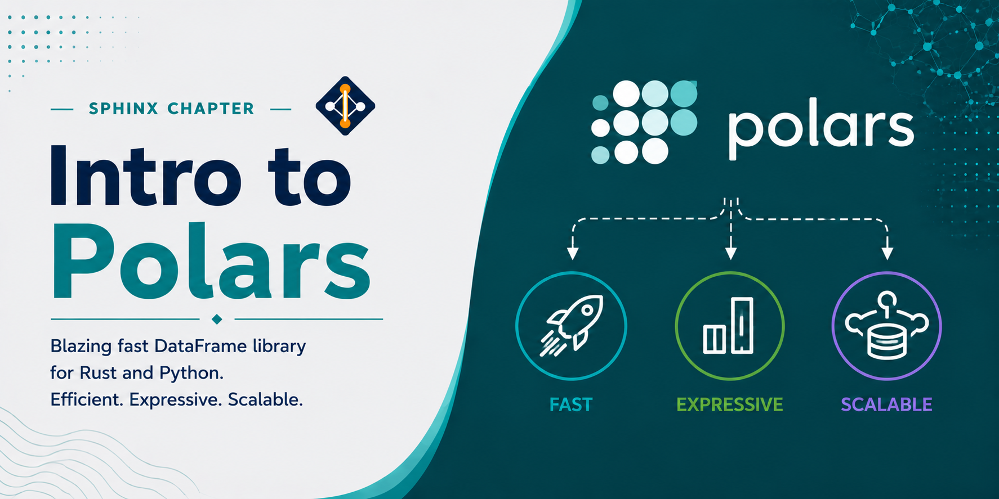

# Intro to Polars



Polars is a high-performance DataFrame library written in Rust with a Python API. It is designed as a faster, more memory-efficient alternative to Pandas for data manipulation and analysis. Polars uses Apache Arrow as its in-memory format, executes queries in parallel by default, and provides both eager and lazy evaluation modes. On the Lane Cluster, Polars is well suited for preprocessing large tabular datasets before feeding them into analysis pipelines.

Unlike Pandas, which operates row-by-row in many cases, Polars compiles operations into an optimized query plan and executes them column-by-column using all available CPU cores. This makes it significantly faster than Pandas for most operations, without requiring any distributed infrastructure.

## What Is Polars Useful For?

- **Large tabular data processing**: filter, join, group, and aggregate datasets with millions of rows faster than Pandas with no extra setup
- **Memory efficiency**: Apache Arrow columnar format uses significantly less memory than Pandas for the same data
- **Lazy evaluation**: build complex multi-step query plans that Polars optimizes and executes in a single pass, avoiding unnecessary intermediate copies
- **Parallel execution**: all operations run across all CPU cores automatically — no configuration needed
- **ETL pipelines**: read, transform, and write CSV, Parquet, JSON, and other formats efficiently
- **Drop-in productivity**: expressive, chainable API similar in style to Pandas but more consistent and less error-prone

---

## Loading Miniconda3

Miniconda3 is available as a module on the Lane Cluster. Load it using:

```bash
module load miniconda3
```

## Creating a Polars Environment

Create a dedicated conda environment for Polars:

```bash
conda create -n polars python=3.11
```

Activate the environment:

```bash
conda activate polars
```

## Installing Polars

With the environment active, install Polars via pip:

```bash
pip install polars
```

Confirm the installation:

```{jupyter-execute}
import polars as pl
print(pl.__version__)
```

---

## Basic Concepts

Polars has two execution modes:

- **Eager mode**: operations execute immediately and return a result, similar to Pandas. Use `pl.DataFrame` for eager evaluation.
- **Lazy mode**: operations build a query plan that is optimized and executed only when `.collect()` is called. Use `pl.LazyFrame` for lazy evaluation. This is the recommended mode for large datasets.

Key data structures:
- `DataFrame`: an in-memory table of columns, each with a fixed data type
- `LazyFrame`: a deferred query plan built from a `DataFrame` or file source
- `Series`: a single typed column, equivalent to a Pandas Series
- `Expr`: an expression that describes a computation on a column, used inside `select`, `filter`, `with_columns`, and `group_by`

---

## Example 1: Creating and Inspecting a DataFrame

This example shows how to construct a Polars DataFrame from a Python dictionary and perform basic inspection. In practice, this is typically your first step after loading a dataset — checking the shape, column types, and summary statistics helps catch data quality issues early before running any analysis.

```{jupyter-execute}
import polars as pl
import numpy as np

np.random.seed(42)
n = 10  # number of samples

# Build a small DataFrame simulating a biological experiment:
# each row is a sample with a condition label, a gene expression value, and a read count
df = pl.DataFrame({
    "sample":     [f"S{i:02d}" for i in range(n)],
    "condition":  np.random.choice(["control", "treated"], size=n).tolist(),
    "expression": np.round(np.random.random(n) * 100, 2).tolist(),
    "count":      np.random.randint(1, 500, size=n).tolist(),
})

print(df)
```

Inspect data types and basic statistics:

```{jupyter-execute}
# dtypes shows the inferred type of each column — useful to catch unexpected object columns
print(df.dtypes)

# describe() computes count, mean, std, min, and max for numeric columns
print(df.describe())
```

---

## Example 2: Filtering, Selecting, and Transforming

This example demonstrates the core Polars expression API. Starting from the DataFrame created above, we filter rows by a threshold, compute a derived column, keep only the relevant columns, and sort the result — all in a single chained operation. This pattern is the backbone of most data cleaning and feature engineering pipelines.

```{jupyter-execute}
result = (
    df
    # Keep only samples with expression above 50
    .filter(pl.col("expression") > 50)
    # Add a normalized ratio column: expression per read count
    .with_columns(
        (pl.col("expression") / pl.col("count")).alias("ratio")
    )
    # Drop columns we no longer need
    .select(["sample", "condition", "expression", "count", "ratio"])
    # Sort by ratio descending to rank samples
    .sort("ratio", descending=True)
)

print(result)
```

Polars expressions are composable and evaluated in parallel. The entire chain above is executed as a single optimized pass over the data — no intermediate DataFrames are created.

---

## Example 3: Group By and Aggregation

This example shows how to compute per-group summary statistics on a large dataset using `group_by` and `agg`. This is one of the most common operations in research data processing — for example, computing mean expression per cell type, average measurement per cohort, or total counts per experimental condition. Polars parallelizes the aggregation across all CPU cores automatically.

```{jupyter-execute}
import polars as pl
import numpy as np

np.random.seed(0)
n = 1_000_000  # 1 million rows to demonstrate parallel aggregation

# Simulate a dataset with 8 groups and two numeric measurements
df_large = pl.DataFrame({
    "group":  np.random.choice(list("ABCDEFGH"), size=n).tolist(),
    "value1": np.random.random(n).tolist(),
    "value2": np.random.random(n).tolist(),
})

result = (
    df_large
    .group_by("group")
    .agg([
        pl.col("value1").mean().alias("value1_mean"),  # average of value1 per group
        pl.col("value1").std().alias("value1_std"),    # standard deviation of value1
        pl.col("value2").sum().alias("value2_sum"),    # total of value2 per group
        pl.len().alias("count"),                       # number of rows in each group
    ])
    .sort("group")  # sort alphabetically for consistent output
)

print(result)
```

---

## Example 4: Lazy Evaluation and Query Optimization

This example illustrates Polars' lazy evaluation mode, which is the recommended approach for multi-step pipelines on large datasets. Instead of executing each operation immediately, Polars builds a query plan and optimizes it before running — pushing filters as early as possible, pruning unused columns, and combining operations to minimize memory allocations. The result is both faster execution and lower peak memory usage compared to eager mode.

```{jupyter-execute}
import polars as pl
import numpy as np

np.random.seed(1)
n = 5_000_000  # 5 million rows to illustrate lazy optimization benefit

# Build a DataFrame and immediately convert to LazyFrame with .lazy()
# No computation happens yet — only the schema is known at this point
df_lazy = pl.DataFrame({
    "sample": [f"S{i}" for i in range(n)],
    "group":  np.random.choice(list("ABCD"), size=n).tolist(),
    "score":  np.random.random(n).tolist(),
    "flag":   np.random.choice([True, False], size=n).tolist(),
}).lazy()

result = (
    df_lazy
    # Filter 1: keep only flagged rows (~50% of data eliminated here)
    .filter(pl.col("flag") == True)
    # Filter 2: keep only high scores (~20% of remaining rows pass)
    .filter(pl.col("score") > 0.8)
    # Compute mean score per group on the already-filtered subset
    .group_by("group")
    .agg(pl.col("score").mean().alias("mean_score"))
    # Sort results for readability
    .sort("mean_score", descending=True)
    # .collect() triggers the full optimized execution
    .collect()
)

print(result)
```

The `.collect()` call at the end triggers execution. Until that point, no data is processed — Polars only holds the query plan.

---

## Example 5: Benchmarking Polars vs Pandas

This example directly compares Polars and Pandas on an identical groupby aggregation task with 10 million rows and multiple value columns. The benchmark measures wall-clock time for both libraries on the same data to demonstrate the performance advantage Polars provides through its parallel, columnar execution engine.

```{jupyter-execute}
import time
import polars as pl
import pandas as pd
import numpy as np

np.random.seed(42)
n = 10_000_000  # 10 million rows

# Build the shared dataset as plain Python lists first
# so neither library has an advantage from data construction
data = {
    "group":  np.random.choice(list("ABCDEFGH"), size=n).tolist(),
    "value1": np.random.random(n).tolist(),
    "value2": np.random.random(n).tolist(),
    "value3": np.random.random(n).tolist(),
}

# --- Pandas benchmark ---
df_pd = pd.DataFrame(data)
start = time.perf_counter()
result_pd = df_pd.groupby("group")[["value1", "value2", "value3"]].agg(["mean", "std", "sum"])
pd_time = time.perf_counter() - start
print(f"Pandas:  {pd_time:.2f}s")

# --- Polars benchmark ---
# Each aggregation needs an explicit alias to avoid duplicate column name errors
df_pl = pl.DataFrame(data)
start = time.perf_counter()
result_pl = (
    df_pl
    .group_by("group")
    .agg([
        pl.col("value1").mean().alias("value1_mean"),
        pl.col("value1").std().alias("value1_std"),
        pl.col("value1").sum().alias("value1_sum"),
        pl.col("value2").mean().alias("value2_mean"),
        pl.col("value2").std().alias("value2_std"),
        pl.col("value2").sum().alias("value2_sum"),
        pl.col("value3").mean().alias("value3_mean"),
        pl.col("value3").std().alias("value3_std"),
        pl.col("value3").sum().alias("value3_sum"),
    ])
    .sort("group")
)
pl_time = time.perf_counter() - start
print(f"Polars:  {pl_time:.2f}s")
print(f"Speedup: {pd_time / pl_time:.2f}x")
```

---

## Example 6: Gene Expression Analysis

This example simulates a typical bulk RNA-seq preprocessing workflow. We start with a raw count matrix (genes × samples) split across two conditions (control and treated), filter out lowly expressed genes that carry no signal, and compute the log2 fold change between conditions. The top upregulated genes are then ranked and reported. In a real pipeline, this output would feed into a statistical testing step such as DESeq2 or edgeR.

```{jupyter-execute}
import polars as pl
import numpy as np

np.random.seed(7)
n_genes   = 5_000   # number of genes in the experiment
n_samples = 12      # 6 control + 6 treated samples

genes   = [f"GENE_{i:04d}" for i in range(n_genes)]
samples = [f"S{i:02d}" for i in range(n_samples)]

# Simulate raw counts using a negative binomial distribution,
# which approximates real RNA-seq count distributions
counts = np.random.negative_binomial(5, 0.3, size=(n_genes, n_samples))

# Inject a strong upregulation signal into the first 50 genes
# in the treated samples (columns 6–11) to create detectable DE genes
counts[:50, 6:] = np.random.negative_binomial(30, 0.3, size=(50, 6))

# Build the DataFrame: one column per sample, one row per gene
data = {"gene": genes}
for i, s in enumerate(samples):
    data[s] = counts[:, i].tolist()

df = pl.DataFrame(data)

# Identify which sample columns belong to each condition
ctrl_cols  = samples[:6]   # S00–S05 are control
treat_cols = samples[6:]   # S06–S11 are treated

# Compute the mean expression across samples within each condition
# concat_list gathers the per-sample values into a list, then list.mean() averages them
df = df.with_columns([
    pl.concat_list([pl.col(c) for c in ctrl_cols]).list.mean().alias("ctrl_mean"),
    pl.concat_list([pl.col(c) for c in treat_cols]).list.mean().alias("treat_mean"),
])

# Remove lowly expressed genes: keep genes with mean >= 5 in at least one condition
# Low-count genes are noisy and inflate the false discovery rate in DE testing
df_filtered = df.filter(
    (pl.col("ctrl_mean") >= 5) | (pl.col("treat_mean") >= 5)
)

# Compute log2 fold change: log2((treat_mean + 1) / (ctrl_mean + 1))
# The +1 pseudocount avoids log(0) for genes with zero mean in one condition
df_filtered = df_filtered.with_columns(
    (pl.col("treat_mean") + 1)
    .truediv(pl.col("ctrl_mean") + 1)
    .log(base=2)
    .alias("log2fc")
)

# Extract the top 10 upregulated genes (highest positive log2fc)
top_up = (
    df_filtered
    .filter(pl.col("log2fc") > 0)           # keep only upregulated genes
    .sort("log2fc", descending=True)         # rank by fold change
    .select(["gene", "ctrl_mean", "treat_mean", "log2fc"])  # keep relevant columns
    .head(10)
)

print(f"Genes passing filter: {len(df_filtered)} / {n_genes}")
print("\nTop 10 upregulated genes:")
print(top_up)
```

---

## Example 7: Joining Sample Metadata with Measurement Data

Research datasets are rarely stored in a single table. It is common to have a metadata table describing each subject or sample and a separate measurements table containing repeated observations. This example simulates joining patient-level metadata (age, sex, cohort, diagnosis) onto a longitudinal biomarker measurements table, then computing per-biomarker summaries stratified by diagnosis group — a typical first step in a clinical cohort analysis.

```{jupyter-execute}
import polars as pl
import numpy as np

np.random.seed(3)
n_patients = 500  # number of unique patients in the study

# Metadata table: one row per patient with demographic and clinical annotations
metadata = pl.DataFrame({
    "patient_id": [f"P{i:04d}" for i in range(n_patients)],
    "age":        np.random.randint(20, 80, size=n_patients).tolist(),
    "sex":        np.random.choice(["M", "F"], size=n_patients).tolist(),
    "cohort":     np.random.choice(["A", "B", "C"], size=n_patients).tolist(),
    # 60% of patients have the disease, 40% are healthy
    "diagnosis":  np.random.choice(["healthy", "disease"], size=n_patients, p=[0.4, 0.6]).tolist(),
})

# Measurements table: repeated biomarker measurements per patient across visits
# Not all patients appear in every visit — this is a realistic sparse design
measurements = pl.DataFrame({
    "patient_id": [f"P{i:04d}" for i in np.random.choice(n_patients, size=2000)],
    "biomarker":  np.random.choice(["CRP", "IL6", "TNF", "INF"], size=2000).tolist(),
    # Exponential distribution approximates positively skewed lab values
    "value":      np.round(np.random.exponential(scale=10, size=2000), 3).tolist(),
    "visit":      np.random.randint(1, 5, size=2000).tolist(),
})

# Left join: keep all measurement rows, attach metadata for each patient_id
# Patients in measurements not found in metadata will have null metadata fields
joined = measurements.join(metadata, on="patient_id", how="left")

# Summarize each biomarker separately for healthy vs disease patients
summary = (
    joined
    .group_by(["biomarker", "diagnosis"])
    .agg([
        pl.col("value").mean().alias("mean_value"),      # mean biomarker level
        pl.col("value").std().alias("std_value"),         # variability
        pl.col("value").median().alias("median_value"),   # robust central tendency
        pl.len().alias("n_observations"),                 # sample size per group
    ])
    .sort(["biomarker", "diagnosis"])  # sort for readable output
)

print(summary)
```

---

## Example 8: Rolling Statistics on Longitudinal Data

Longitudinal studies collect repeated measurements from the same subject over time. Before training a model on such data, it is common to engineer time-aware features: smoothed values to reduce noise, cumulative extremes to capture trajectory, and visit-to-visit deltas to capture rate of change. This example computes all three for a simulated clinical score dataset with 100 subjects across 20 visits. The `.over("subject")` clause ensures that each window operation is applied independently per subject, so no subject's data leaks into another's statistics.

```{jupyter-execute}
import polars as pl
import numpy as np

np.random.seed(9)
n_subjects = 100   # number of study participants
n_visits   = 20    # number of clinic visits per subject

# Repeat each subject ID n_visits times to create the longitudinal structure
subject_ids = np.repeat([f"SUB_{i:03d}" for i in range(n_subjects)], n_visits)
# Tile visit numbers 1–20 for each subject
visit_nums  = np.tile(np.arange(1, n_visits + 1), n_subjects)
# Base score drawn from a normal distribution
scores      = np.random.normal(loc=50, scale=10, size=n_subjects * n_visits)
# Add a linear upward trend across visits to simulate clinical improvement
scores     += np.tile(np.linspace(0, 15, n_visits), n_subjects)

df = pl.DataFrame({
    "subject": subject_ids.tolist(),
    "visit":   visit_nums.tolist(),
    "score":   np.round(scores, 2).tolist(),
})

df_rolling = (
    df
    # Sort is required before rolling/cumulative operations to ensure visit order
    .sort(["subject", "visit"])
    .with_columns([
        # 3-visit rolling mean to smooth noise; min_samples=1 avoids nulls at the start
        pl.col("score")
          .rolling_mean(window_size=3, min_samples=1)
          .over("subject")                    # compute independently per subject
          .alias("rolling_mean_3"),

        # Cumulative maximum tracks the best score the subject has achieved so far
        pl.col("score")
          .cum_max()
          .over("subject")
          .alias("cumulative_max"),

        # Visit delta: how much the score changed since the previous visit
        # The first visit will be null because there is no prior visit to diff against
        pl.col("score")
          .diff()
          .over("subject")
          .alias("visit_delta"),
    ])
)

# Show the first 25 rows (covering the first subject and the start of the second)
print(df_rolling.head(25))
```

---

## Example 9: ETL Pipeline — Clean, Transform, and Write Parquet

This example walks through a complete extract-transform-load pipeline as it would appear in a proteomics or metabolomics study. Raw instrument data often contains failed QC samples, missing measurements, and batch effects. The pipeline removes failed samples, imputes missing protein values using the per-batch median (a standard approach that avoids introducing cross-batch bias), derives a normalized ratio between two proteins, and standardizes it within each batch. The cleaned data is then written to Parquet — the preferred format for downstream Polars and Spark workflows — and read back to confirm the round-trip. Using lazy evaluation here means Polars can optimize the entire multi-step plan before touching any data.

```{jupyter-execute}
import polars as pl
import numpy as np
import tempfile, os

np.random.seed(5)
n = 200_000  # 200,000 samples across four instrument batches

# Simulate raw proteomics data with realistic imperfections:
# ~5% missing values in protein_a, ~8% in protein_b, and ~15% failed QC rows
raw = pl.DataFrame({
    "sample_id": [f"SMP{i:06d}" for i in range(n)],
    "batch":     np.random.choice(["B1", "B2", "B3", "B4"], size=n).tolist(),
    # Introduce nulls by setting ~5% of values to None
    "protein_a": [float(v) if np.random.random() > 0.05 else None
                  for v in np.round(np.random.normal(100, 15, size=n), 2)],
    # Introduce nulls by setting ~8% of values to None
    "protein_b": [float(v) if np.random.random() > 0.08 else None
                  for v in np.round(np.random.normal(50, 10, size=n), 2)],
    # 85% PASS, 10% FAIL, 5% WARN — only PASS samples are usable
    "qc_flag":   np.random.choice(["PASS", "FAIL", "WARN"], size=n, p=[0.85, 0.1, 0.05]).tolist(),
})

# Build the full ETL pipeline as a lazy query — nothing executes until .collect()
result = (
    raw.lazy()

    # Step 1: remove samples that failed QC — these have unreliable measurements
    .filter(pl.col("qc_flag") == "PASS")

    # Step 2: remove rows where both proteins are missing — no imputation is possible
    .filter(pl.col("protein_a").is_not_null() | pl.col("protein_b").is_not_null())

    # Step 3: impute remaining nulls with the per-batch median
    # Using .over("batch") computes the median separately within each batch,
    # which prevents cross-batch contamination during imputation
    .with_columns([
        pl.col("protein_a").fill_null(pl.col("protein_a").median().over("batch")),
        pl.col("protein_b").fill_null(pl.col("protein_b").median().over("batch")),
    ])

    # Step 4: compute the protein A / protein B ratio
    # This ratio is a common normalization in proteomics to reduce sample loading variation
    .with_columns([
        (pl.col("protein_a") / pl.col("protein_b")).alias("ratio_ab"),
    ])

    # Step 5: z-score the ratio within each batch to remove batch effects
    # (value - batch_mean) / batch_std centers and scales within each batch
    .with_columns([
        ((pl.col("ratio_ab") - pl.col("ratio_ab").mean().over("batch"))
         / pl.col("ratio_ab").std().over("batch")).alias("ratio_zscore"),
    ])

    # Trigger execution of the full optimized plan
    .collect()
)

print(f"Raw rows:    {len(raw):,}")
print(f"Clean rows:  {len(result):,}")
print(result.head(8))

# Write to Parquet and verify the round-trip
# Parquet is column-oriented and compressed, making it much smaller than CSV
with tempfile.TemporaryDirectory() as tmpdir:
    parquet_path = os.path.join(tmpdir, "clean_data.parquet")
    result.write_parquet(parquet_path)                    # write compressed Parquet file
    reloaded = pl.read_parquet(parquet_path)              # read it back to verify
    print(f"\nParquet file size: {os.path.getsize(parquet_path) / 1024:.1f} KB")
    print(f"Rows reloaded from Parquet: {len(reloaded):,}")
```

---

## Best Practices

- Prefer lazy evaluation (`LazyFrame`) over eager evaluation for multi-step pipelines — Polars will optimize and combine operations automatically.
- Use `pl.col()` expressions instead of column indexing (`df["col"]`) inside transformations to stay within the optimized execution path.
- Use Parquet format for reading and writing large datasets — Polars reads Parquet significantly faster than CSV and supports predicate pushdown.
- Avoid converting back and forth between Polars and Pandas unnecessarily; use `df.to_pandas()` and `pl.from_pandas()` only at the boundaries of your pipeline.
- Use `df.describe()` and `df.schema` early in a pipeline to verify data types and catch type mismatches before they cause silent errors downstream.

---

## References

- Polars documentation: [https://docs.pola.rs/]
- Polars GitHub: [https://github.com/pola-rs/polars]
- Polars user guide: [https://docs.pola.rs/user-guide/]
