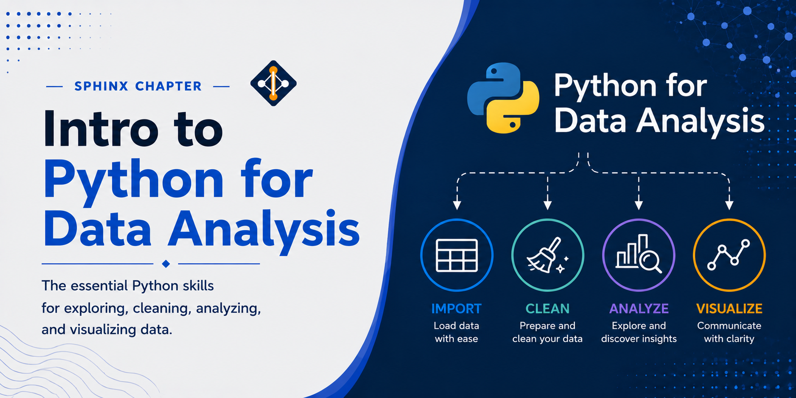

# Python for Data Analysis



Python has become the dominant language for data analysis over the past decade, displacing dedicated tools like R, MATLAB, and SAS across both academia and industry. Several factors drove this shift. Python's syntax is readable and approachable, lowering the barrier for researchers who are not trained software engineers. Its ecosystem grew rapidly: Pandas (2008) brought DataFrame-style tabular data manipulation to the language; NumPy provided the array primitives that everything else built on; Matplotlib and then Seaborn made visualization accessible; and scikit-learn made machine learning a few lines of code rather than a research project. The rise of Jupyter notebooks accelerated adoption further by letting analysts mix code, output, and narrative in a single shareable document — a workflow that fit naturally into scientific practice.

The explosion of deep learning after 2012 cemented Python's position. PyTorch and TensorFlow both chose Python as their primary interface, which meant that anyone working in AI or ML was already in the Python ecosystem. This created a flywheel effect: more users meant more libraries, better tooling, and a larger community, which attracted still more users. Today, Python is the default assumption in data science job postings, graduate research, and most HPC workflows involving data-intensive computation.

On the performance side, the ecosystem has continued to mature to meet the demands of large-scale data. Libraries like Polars offer Rust-backed DataFrames that outperform Pandas on large datasets. Dask and Ray allow Python code to scale across multiple cores or cluster nodes with minimal changes. DuckDB brings analytical SQL execution directly into the Python process, fast enough to replace heavyweight data warehouse queries for many workloads. These advances mean Python is no longer a slow scripting language bolted onto faster compiled code — it is the orchestration layer for a stack of highly optimized engines.

Python is the primary language for scientific computing and data analysis on the Lane Cluster. This section covers the most commonly used Python libraries for working with large tabular datasets, from the foundational Pandas library to high-performance alternatives such as Polars, distributed computing with Dask, and analytical SQL queries with DuckDB.

```{toctree}
:maxdepth: 1

pandas
polars
dask
duckdb
```
