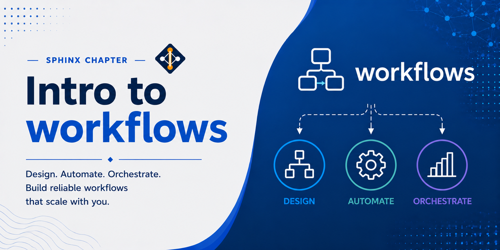

# Intro to Workflows



A **workflow** is a structured sequence of computational steps where the output of one step feeds into the input of the next. In scientific computing, workflows are used to orchestrate multi-stage analyses — from raw data ingestion and preprocessing, through computation and modelling, to result generation and reporting — in a way that is automated, reproducible, and auditable.

A **workflow framework** provides the infrastructure to define, schedule, execute, monitor, and recover from failures in these pipelines. Without a framework, multi-step analyses are typically written as shell scripts or manual sequences of commands that are fragile, hard to parallelize, and difficult to reproduce on a different machine or after a system upgrade.

## Key Concepts

- **DAG (Directed Acyclic Graph)**: the structure underlying most workflow frameworks. Each node is a computational step; each edge is a data dependency. A DAG guarantees there are no circular dependencies and makes it possible to determine which steps can run in parallel.
- **Task / Step / Job**: a single unit of work in a pipeline — running a script, calling a function, or executing a command-line tool.
- **Dependency**: a declared relationship between tasks. A task only starts after all its upstream dependencies have completed successfully.
- **Scheduler**: the component that decides when and where to run each task, respecting dependencies and resource constraints.
- **Executor**: the component that physically runs a task — locally, on SLURM, or in the cloud.
- **Artifact**: a file, dataset, or value produced by a task and consumed by a downstream task.
- **Provenance**: the record of what ran, when, with what inputs, and what outputs were produced. Workflow frameworks maintain this automatically to support reproducibility and debugging.

## What Are Workflows Useful For?

- **Reproducibility**: the pipeline definition is code, so the exact same analysis can be re-run at any time on any compatible system
- **Parallelism**: independent steps are identified automatically and run concurrently, reducing wall-clock time
- **Failure recovery**: most frameworks can resume a failed pipeline from the last successful step rather than restarting from scratch
- **Scalability**: the same workflow logic runs locally for testing and on a SLURM cluster or cloud for production without code changes
- **Auditability**: every run is logged with its inputs, outputs, parameters, and timing, making it easy to trace results back to their source
- **Collaboration**: pipelines defined as code can be version-controlled, reviewed, and shared like any other software

---

## Workflow Frameworks Available via Miniconda3

All of the frameworks below can be installed into a conda environment on the Lane Cluster using `conda install` or `pip install` after loading the `miniconda3` module.

```bash
module load miniconda3
conda create -n workflows python=3.11
conda activate workflows
```

---

## Comparison of Python Workflow Frameworks

| Framework | Primary Language | Workflow Style | SLURM Support | Best For |
|---|---|---|---|---|
| [Nextflow](https://www.nextflow.io/) | Groovy DSL | Dataflow (channels) | Native | Bioinformatics pipelines, HPC |
| [Snakemake](https://snakemake.readthedocs.io/) | Python + rules | Make-like (file targets) | Native | File-based scientific workflows |
| [CWL / cwltool](https://www.commonwl.org/) | YAML standard | Declarative (portable) | Via engine | Cross-platform reproducibility |
| [Flyte](https://docs.flyte.org/) | Python (flytekit) | DAG (typed tasks) | Via plugin | ML pipelines, typed data |
| [Metaflow](https://docs.metaflow.org/) | Python decorators | Step-based DAG | Via plugin | Data science, experiment tracking |
| [Dagster](https://docs.dagster.io/) | Python (assets/ops) | Asset-centric DAG | Via executor | Data engineering, observability |
| [Prefect](https://docs.prefect.io/) | Python decorators | Dynamic DAG | Via agent | General-purpose, cloud-friendly |
| [Luigi](https://luigi.readthedocs.io/) | Python classes | Dependency graph | Via wrapper | ETL, batch pipelines |
| [Airflow](https://airflow.apache.org/docs/) | Python (operators) | Scheduled DAG | Via operator | Scheduled ETL, data pipelines |

---

## Pros and Cons

### Nextflow

[Website](https://www.nextflow.io/) | [GitHub](https://github.com/nextflow-io/nextflow)

Nextflow uses a dataflow model where processes communicate through channels. It is the dominant framework in computational biology for HPC workflows.

> **Miniconda3 / HPC**: Nextflow can be installed via `conda install -c conda-forge -c bioconda nextflow`. It integrates natively with SLURM and is one of the best-supported frameworks on HPC systems. Recommended for bioinformatics pipelines on lanec2.

| Pros | Cons |
|---|---|
| Native SLURM and cloud executor | Groovy DSL has a steep learning curve |
| First-class container support (Docker, Apptainer) | Debugging dataflow errors can be difficult |
| Large bioinformatics ecosystem (nf-core) | Not well suited for Python-heavy ML workflows |
| Resume failed runs with `-resume` | Less intuitive for non-bioinformatics use cases |
| Scales from laptop to cluster without code changes | Groovy is not widely known outside Nextflow |

---

### Snakemake

[Website](https://snakemake.readthedocs.io/) | [PyPI](https://pypi.org/project/snakemake/) | [GitHub](https://github.com/snakemake/snakemake)

Snakemake is inspired by GNU Make and defines workflows as rules that specify how to produce output files from input files. It is widely used in genomics and bioinformatics.

> **Miniconda3 / HPC**: Install via `conda install -c conda-forge -c bioconda snakemake`. Snakemake has native SLURM support via its `--executor slurm` profile and integrates directly with conda environments per rule, making it an excellent fit for lanec2.

| Pros | Cons |
|---|---|
| Familiar Make-like syntax, easy to learn | File-centric model is awkward for non-file outputs |
| Native SLURM integration | Large workflows can have complex rule interactions |
| Automatic parallelization of independent rules | Debugging wildcards requires experience |
| Conda and container integration per rule | Less suited for dynamic or data-driven workflows |
| Widely adopted in bioinformatics communities | GUI and monitoring tools are limited |

---

### CWL (Common Workflow Language)

[Website](https://www.commonwl.org/) | [PyPI](https://pypi.org/project/cwltool/) | [GitHub](https://github.com/common-workflow-language/cwltool)

CWL is an open standard rather than a single tool. Workflows written in CWL can run on any CWL-compatible engine, making them maximally portable.

> **Miniconda3 / HPC**: Install the reference engine via `conda install -c conda-forge cwltool`. CWL runs well on lanec2 for single-node workflows. For SLURM-distributed execution, a CWL runner with SLURM support (such as `toil`) is required instead of `cwltool`.

| Pros | Cons |
|---|---|
| Platform-neutral open standard | Very verbose YAML syntax |
| Runs on any CWL-compatible engine | Steep learning curve for complex workflows |
| Supported by major bioinformatics repositories | Limited dynamic logic (no conditionals in v1.2) |
| Strong tool reuse via public registries (Dockstore) | Slower iteration than code-based frameworks |
| Excellent provenance and validation support | Debugging requires familiarity with the spec |

---

### Flyte

[Website](https://flyte.org/) | [PyPI](https://pypi.org/project/flytekit/) | [GitHub](https://github.com/flyteorg/flyte)

Flyte is a typed, cloud-native workflow orchestration platform developed at Lyft and used in production ML systems. Tasks are Python functions decorated with `@task`.

> **Miniconda3 / HPC**: Install the Python SDK via `pip install flytekit`. Local execution with `pyflyte run` works without any backend and is suitable for development and testing on lanec2. Full SLURM or multi-node execution requires deploying a Flyte backend, which is not available by default on the cluster.

| Pros | Cons |
|---|---|
| Strong typing catches errors at registration time | Requires a Flyte backend (FlyteAdmin) to run at scale |
| Native versioning of tasks and workflows | More complex infrastructure setup than lighter frameworks |
| Built-in data lineage and artifact tracking | Overkill for small or ad hoc pipelines |
| Scales from local to Kubernetes natively | Smaller community than Airflow or Prefect |
| Excellent for ML training and evaluation pipelines | Python-only; less bioinformatics tooling |

---

### Metaflow

[Website](https://metaflow.org/) | [PyPI](https://pypi.org/project/metaflow/) | [GitHub](https://github.com/Netflix/metaflow)

Metaflow was developed at Netflix to make data science workflows easy to build, version, and scale. Steps are methods in a Python class.

> **Miniconda3 / HPC**: Install via `pip install metaflow`. Local execution works out of the box on lanec2 without any additional services. SLURM support is available via the `metaflow-slurm` plugin but requires additional configuration. Best used for data science experimentation where local execution is sufficient.

| Pros | Cons |
|---|---|
| Minimal boilerplate — plain Python classes | Requires AWS or a Metaflow service for full cloud features |
| Automatic versioning and artifact storage | Not designed for file-based bioinformatics pipelines |
| Built-in experiment tracking and result inspection | SLURM support requires additional configuration |
| Easy to run locally and scale to the cloud | Less mature than Airflow for scheduled production workflows |
| Good for iterative data science and ML experiments | Smaller ecosystem than nf-core or Airflow |

---

### Dagster

[Website](https://dagster.io/) | [PyPI](https://pypi.org/project/dagster/) | [GitHub](https://github.com/dagster-io/dagster)

Dagster is an asset-centric orchestration platform where pipelines are defined in terms of the data objects they produce rather than the tasks that run. It has a rich built-in UI (Dagit).

> **Miniconda3 / HPC**: Install via `pip install dagster dagster-webserver`. Dagster runs locally on lanec2 without any external services — use `dagster dev` to launch the UI for interactive development. For SLURM integration, jobs can be submitted via the `dagster-pipes` interface or wrapped in SLURM batch scripts.

| Pros | Cons |
|---|---|
| Software-defined assets make data lineage explicit | Higher learning curve than simpler frameworks |
| Excellent built-in observability (Dagit UI) | Asset model can feel over-engineered for simple pipelines |
| Strong testing support (unit-testable ops) | Relatively young ecosystem compared to Airflow |
| Resource injection makes code modular and reusable | Requires more boilerplate than Metaflow or Prefect |
| Actively developed with rapid feature releases | Less bioinformatics-specific tooling |

---

### Prefect

[Website](https://www.prefect.io/) | [PyPI](https://pypi.org/project/prefect/) | [GitHub](https://github.com/PrefectHQ/prefect)

Prefect is a modern Python workflow framework focused on simplicity, dynamic DAGs, and cloud-first deployment. Workflows are plain Python functions decorated with `@flow` and `@task`.

> **Miniconda3 / HPC**: Install via `pip install prefect`. Flows run locally on lanec2 without any external service — simply call the flow function directly or use `prefect run`. Scheduled or remote execution requires Prefect Cloud or a self-hosted Prefect server, which is not available by default on the cluster.

| Pros | Cons |
|---|---|
| Very low boilerplate — minimal code changes to existing scripts | Cloud features require Prefect Cloud account |
| Dynamic DAGs support runtime branching and loops | SLURM integration is less mature than Nextflow or Snakemake |
| Excellent UI for monitoring runs and failures | Less suited for file-based bioinformatics workflows |
| Easy local development and cloud deployment | Smaller HPC user base than Snakemake or Nextflow |
| Active community and frequent releases | Persistent agent required for scheduled runs |

---

### Luigi

[Website](https://luigi.readthedocs.io/) | [PyPI](https://pypi.org/project/luigi/) | [GitHub](https://github.com/spotify/luigi)

Luigi is one of the earliest Python workflow frameworks, developed at Spotify. Workflows are defined as Python classes where each task declares its dependencies and outputs.

> **Miniconda3 / HPC**: Install via `pip install luigi`. Luigi runs entirely locally with no external services required, making it straightforward to use on lanec2. There is no native SLURM executor; SLURM jobs must be submitted manually inside task bodies using `subprocess`. Suitable for simple batch ETL pipelines where native HPC integration is not needed.

| Pros | Cons |
|---|---|
| Simple dependency model, easy to understand | No native parallel execution (requires wrapper) |
| Mature and stable — production-tested at scale | UI is basic compared to Dagster or Prefect |
| No external service required to run locally | Verbose class-based API compared to decorator-based frameworks |
| Good for batch ETL and data warehouse pipelines | Less active development than newer frameworks |
| Works well with HDFS, S3, and local filesystems | Not well suited for HPC or bioinformatics workflows |

---

### Apache Airflow

[Website](https://airflow.apache.org/) | [PyPI](https://pypi.org/project/apache-airflow/) | [GitHub](https://github.com/apache/airflow)

Apache Airflow is the most widely used workflow scheduler in data engineering. Workflows (DAGs) are defined in Python and scheduled on a cron-like basis via the Airflow scheduler.

> **Miniconda3 / HPC**: Install via `pip install apache-airflow`. Airflow requires a running scheduler process, a webserver, and a metadata database (SQLite works for local testing). This overhead makes it impractical for typical research use on lanec2 without a dedicated deployment. Not recommended for HPC workflows — use Nextflow or Snakemake instead.

| Pros | Cons |
|---|---|
| Extremely large ecosystem of operators and integrations | Heavyweight — requires a scheduler, webserver, and database |
| Mature, battle-tested at enterprise scale | DAGs are static — dynamic runtime logic is awkward |
| Rich UI for monitoring, retrying, and auditing runs | High operational overhead for small teams |
| Supports dozens of executors including Celery and Kubernetes | Not designed for HPC or bioinformatics pipelines |
| Large community and extensive documentation | Overkill for research workflows; better suited for production ETL |

---

## Choosing the Right Framework

Use this guide as a starting point:

- **Bioinformatics / genomics pipeline on HPC** → Nextflow or Snakemake
- **Cross-institution reproducibility / public sharing** → CWL
- **Machine learning training and evaluation** → Flyte or Metaflow
- **Data engineering with observability** → Dagster or Prefect
- **Scheduled production ETL at scale** → Apache Airflow
- **Quick ad hoc batch pipeline in Python** → Luigi or Prefect

When in doubt, start with the framework your team or collaborators already use — ecosystem compatibility and shared knowledge often matter more than raw feature comparisons.

---

## References

- Nextflow: [https://www.nextflow.io/]
- Snakemake: [https://snakemake.readthedocs.io/]
- CWL: [https://www.commonwl.org/]
- Flyte: [https://docs.flyte.org/]
- Metaflow: [https://docs.metaflow.org/]
- Dagster: [https://docs.dagster.io/]
- Prefect: [https://docs.prefect.io/]
- Luigi: [https://luigi.readthedocs.io/]
- Apache Airflow: [https://airflow.apache.org/docs/]

```{toctree}
:maxdepth: 1

cwl
snakemake
nextflow
dagster
metaflow
flyte
```
